## Openssl 


### 用法

OpenSSL 是一个开源项目，其组成主要包括一下三个组件：

- openssl：多用途的命令行工具
- libcrypto：加密算法库
- libssl：加密模块应用库，实现了ssl及tls

openssl可以实现：秘钥证书管理、对称加密和非对称加密 。

#### 1、对称加密

对称加密需要使用的标准命令为 enc ，用法如下：

```
openssl enc -ciphername [-in filename] [-out filename] [-pass arg] [-e] [-d] [-a/-base64]
       [-A] [-k password] [-kfile filename] [-K key] [-iv IV] [-S salt] [-salt] [-nosalt] [-z] [-md]
       [-p] [-P] [-bufsize number] [-nopad] [-debug] [-none] [-engine id]
```

常用选项有：

-in filename：指定要加密的文件存放路径

-out filename：指定加密后的文件存放路径

-salt：自动插入一个随机数作为文件内容加密，默认选项

-e：可以指明一种加密算法，若不指的话将使用默认加密算法

-d：解密，解密时也可以指定算法，若不指定则使用默认算法，但一定要与加密时的算法一致

-a/-base64：使用-base64位编码格式

```
示例：
加密：]# openssl enc -e -des3 -a -salt -in fstab -out jiami
解密：]# openssl enc -d -des3 -a -salt -in fstab -out jiami
```

#### 2、单向加密

单向加密需要使用的标准命令为 dgst ，用法如下：

```
openssl dgst [-md5|-md4|-md2|-sha1|-sha|-mdc2|-ripemd160|-dss1] [-c] [-d] [-hex] [-binary]
       [-out filename] [-sign filename] [-keyform arg] [-passin arg] [-verify filename] [-prverify
       filename] [-signature filename] [-hmac key] [file...]
```

常用选项有：

[-md5|-md4|-md2|-sha1|-sha|-mdc2|-ripemd160|-dss1] ：指定一种加密算法

-out filename：将加密的内容保存到指定文件中

示例如下：

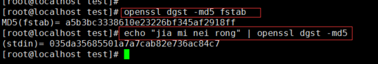

单向加密除了 openssl dgst 工具还有： md5sum，sha1sum，sha224sum，sha256sum ，sha384sum，sha512sum

示例如下：

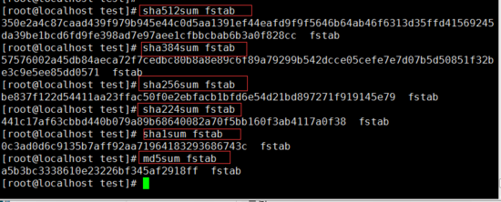

#### 3、生成密码

生成密码需要使用的标准命令为 passwd ，用法如下：

```
openssl passwd [-crypt] [-1] [-apr1] [-salt string] [-in file] [-stdin] [-noverify] [-quiet] [-table] {password}
```

常用选项有：

-1：使用md5加密算法

-salt string：加入随机数，最多8位随机数

-in file：对输入的文件内容进行加密

-stdion：对标准输入的内容进行加密

示例如下：

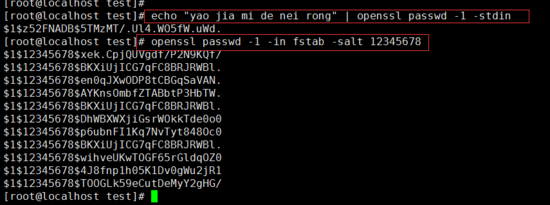

#### 4、生成随机数

生成随机数需要用到的标准命令为 rand ，用法如下：

```
openssl rand [-out file] [-rand file(s)] [-base64] [-hex] num
```

常用选项有：

-out file：将生成的随机数保存至指定文件中

-base64：使用base64 编码格式

-hex：使用16进制编码格式

示例如下：

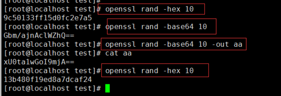

#### 5、生成秘钥对

首先需要先使用 genrsa 标准命令生成私钥，然后再使用 rsa 标准命令从私钥中提取公钥。

genrsa 的用法如下：

```
openssl genrsa [-out filename] [-passout arg] [-des] [-des3] [-idea] [-f4] [-3] [-rand file(s)] [-engine id] [numbits]
```

常用选项有：

-out filename：将生成的私钥保存至指定的文件中

-des|-des3|-idea：不同的加密算法

numbits：指定生成私钥的大小，默认是2048

一般情况下秘钥文件的权限一定要控制好，只能自己读写，因此可以使用 umask 命令设置生成的私钥权限，示例如下：

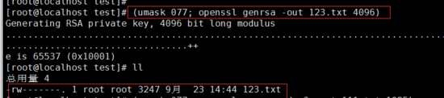

ras 的用法如下：

```
openssl rsa [-inform PEM|NET|DER] [-outform PEM|NET|DER] [-in filename] [-passin arg] [-out filename] [-passout arg]
       [-sgckey] [-des] [-des3] [-idea] [-text] [-noout] [-modulus] [-check] [-pubin] [-pubout] [-engine id]
```

常用选项：

-in filename：指明私钥文件

-out filename：指明将提取出的公钥保存至指定文件中 

-pubout：根据私钥提取出公钥 

示例如下：

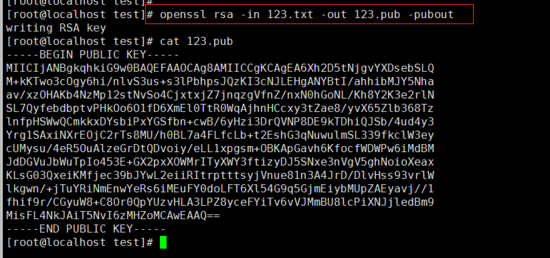

#### 6、创建CA和申请证书

使用openssl工具创建CA证书和申请证书时，需要先查看配置文件，因为配置文件中对证书的名称和存放位置等相关信息都做了定义，具体可参考 /etc/pki/tls/openssl.cnf 文件。

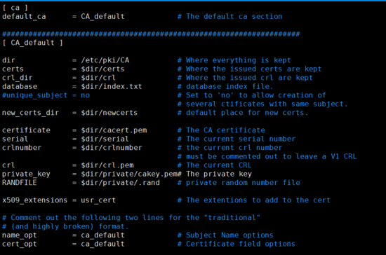

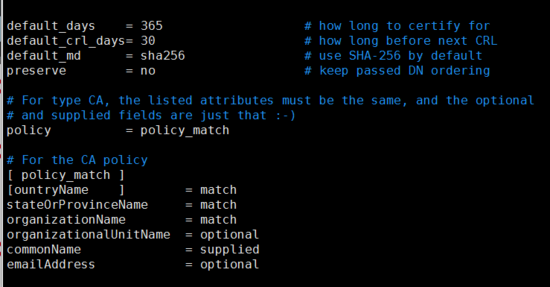

#### （1）、创建自签证书

第一步：创建为 CA 提供所需的目录及文件

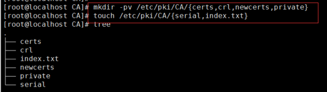

第二步：指明证书的开始编号

]# echo 01 >> serial 

第三步：生成私钥，私钥的文件名与存放位置要与配置文件中的设置相匹配；

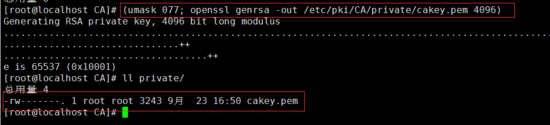

第四步：生成自签证书，自签证书的存放位置也要与配置文件中的设置相匹配，生成证书时需要填写相应的信息；

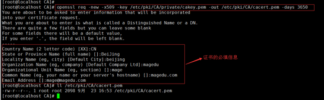

命令中用到的选项解释：

-new：表示生成一个新证书签署请求

-x509：专用于CA生成自签证书，如果不是自签证书则不需要此项

-key：生成请求时用到的私钥文件

-out：证书的保存路径

-days：证书的有效期限，单位是day（天），默认是365天

#### （2）颁发证书

在需要使用证书的主机上生成证书请求，以 httpd 服务为例，步骤如下：

第一步：在需要使用证书的主机上生成私钥，这个私钥文件的位置可以随意定

第二步：生成证书签署请求

第三步：将请求通过可靠方式发送给 CA 主机

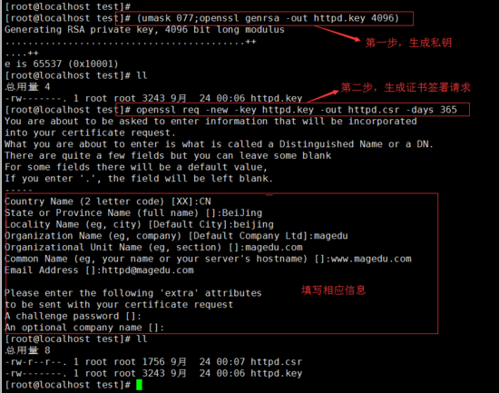

第四步：CA 服务器拿到证书签署请求文件后颁发证书，这一步是在 CA 服务器上做的

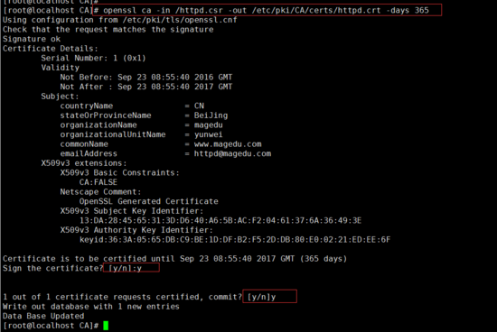

查看证书信息的命令为：

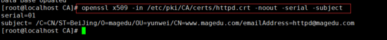

#### （3）吊销证书

吊销证书的步骤也是在CA服务器上执行的，以刚才新建的 httpd.crt 证书为例，吊销步骤如下：

第一步：在客户机上获取要吊销证书的 serial 和 subject 信息 

第二步：根据客户机提交的 serial 和 subject 信息，对比其余本机数据库 index.txt 中存储的是否一致 

第三步：执行吊销操作

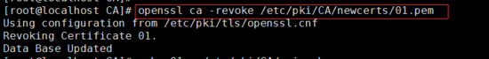

第四步：生成吊销证书的吊销编号 （第一次吊销证书时执行）

]# echo 01 > /etc/pki/CA/crlnumber

第五步：更新证书吊销列表

]# openssl ca -gencrl -out /etc/pki/CA/crl/ca.crl

查看 crl 文件命令：

]# openssl crl -in /etc/pki/CA/crl/ca.crl -noout -text

扩展：

- https://www.cnblogs.com/yangxiaolan/p/6256838.html
- https://blog.csdn.net/scuyxi/article/details/54884976


### 查看证书信息

1. 打印证书的过期时间

```bash
openssl x509 -in signed.crt -noout -dates
```

1. 打印出证书的内容：

```bash
openssl x509 -in cert.pem -noout -text
```

1. 打印出证书的系列号

```bash
openssl x509 -in cert.pem -noout -serial
```

1. 打印出证书的拥有者名字

```bash
openssl x509 -in cert.pem -noout -subject
```

1. 以RFC2253规定的格式打印出证书的拥有者名字

```
openssl x509 -in cert.pem -noout -subject -nameopt RFC2253
```

1. 在支持UTF8的终端一行过打印出证书的拥有者名字

```bash
openssl x509 -in cert.pem -noout -subject -nameopt oneline -nameopt -escmsb
```

1. 打印出证书的MD5特征参数

```bash
openssl x509 -in cert.pem -noout -fingerprint
```

1. 打印出证书的SHA特征参数

```bash
openssl x509 -sha1 -in cert.pem -noout -fingerprint
```

1. 把PEM格式的证书转化成DER格式

```bash
openssl x509 -in cert.pem -inform PEM -out cert.der -outform DER
```

1. 把一个证书转化成CSR

```bash
openssl x509 -x509toreq -in cert.pem -out req.pem -signkey key.pem
```

1. 给一个CSR进行处理，颁发字签名证书，增加CA扩展项

```bash
openssl x509 -req -in careq.pem -extfile openssl.cnf -extensions v3_ca -signkey key.pem -out cacert.pem
```

1. 给一个CSR签名，增加用户证书扩展项

```bash
openssl x509 -req -in req.pem -extfile openssl.cnf -extensions v3_usr -CA cacert.pem -CAkey key.pem -CAcreateserial
```

1. 查看csr文件细节：

```bash
openssl req -in my.csr -noout -text
```


### 生成二级证书

 一、前言
使用自签ca证书，给二级ca签发生成的证书默认不具备给三级证书签发的能力。
需要指定 -extensions v3_ca参数。 

 二 相关命令 

```sh
// 生成顶级CA的公钥证书和私钥文件，有效期10年（RSA 1024bits，默认）
openssl req -new -x509 -days 3650 -keyout CARoot.key -out CARoot.crt 
// 为顶级CA的私钥文件去除保护口令
openssl rsa -in CARoot.key -out CARoot.key

// 为应用证书/中级证书生成私钥文件
openssl genrsa -out roota.key 1024
// 根据私钥文件，为应用证书/中级证书生成 csr 文件（证书请求文件）
openssl req -new -key roota.key -out roota.csr

// 使用CA的公私钥文件给 csr 文件签名，生成中级证书，有效期5年
openssl ca -extensions v3_ca -in roota.csr -out roota.crt -cert CARoot.crt -keyfile CARoot.key -days 1826 -policy policy_anything

//生成服务rootb
openssl genrsa -out rootb.key 1024
openssl req -new -key rootb.key -out rootb.csr
openssl ca -extensions v3_ca -in rootb.csr -out rootb.crt -cert CARoot.crt -keyfile CARoot.key -days 1826 -policy policy_anything

///生成服务roota-1
openssl genrsa -out roota-1.key 1024
openssl req -new -key roota-1.key -out roota-1.csr
openssl ca -in roota-1.csr -out roota-1.crt -cert roota.crt -keyfile roota.key -days 1826 -policy policy_anything
///生成p12
openssl pkcs12 -export -clcerts -in roota-1.crt -inkey roota-1.key -out roota-1.p12 
//p12转jks
keytool -importkeystore -srckeystore roota-1.p12 -srcstoretype PKCS12 -deststoretype JKS -destkeystore roota-1.jks

///生成客户端rootb-1
openssl genrsa -out rootb-1.key 1024
openssl req -new -key rootb-1.key -out rootb-1.csr
openssl ca -in rootb-1.csr -out rootb-1.crt -cert rootb.crt -keyfile rootb.key -days 1826 -policy policy_anything
///生成p12
openssl pkcs12 -export -clcerts -in roota-1.crt -inkey roota-1.key -out roota-1.p12 
//p12转jks
keytool -importkeystore -srckeystore roota-1.p12 -srcstoretype PKCS12 -deststoretype JKS -destkeystore roota-1.jks

//服务端导入信任
keytool -import -alias root -file CARoot.crt -keystore roota-1.jks
keytool -import -alias rootb -file rootb.crt -keystore roota-1.jks  //报错不是x509格式
//转为x509
openssl x509 -in rootb.crt -out -rootb.cer
keytool -import -alias rootb -file rootb.cer -keystore roota-1.jks

//cn为ip地址172.20.186.196 roota-2
///生成服务roota-2
openssl genrsa -out roota-2.key 1024
openssl req -new -key roota-2.key -out roota-2.csr
openssl ca -in roota-2.csr -out roota-2.crt -cert roota.crt -keyfile roota.key -days 1826 -policy policy_anything
///生成p12
openssl pkcs12 -export -clcerts -in roota-2.crt -inkey roota-2.key -out roota-2.p12 
//p12转jks
keytool -importkeystore -srckeystore roota-2.p12 -srcstoretype PKCS12 -deststoretype JKS -destkeystore roota-2.jks
keytool -import -alias root -file CARoot.crt -keystore roota-2.jks
keytool -import -alias rootb -file rootb.cer -keystore roota-2.jks
```


### 生成 CA 证书

0、根据私钥生成的证书请求csr文件中是包含 公钥的，并且在 最后签发的证书也是存在公钥的

```sh
#1、查看证书中的公钥
openssl x509 -in server.crt  -noout -pubkey

#根据私钥生成公钥，并且查看生成的公钥信息
openssl rsa -in server.key -out server.pub -pubout

# 3、对比生成的公钥与证书中的公钥
diff 
```


1、生成  ca.key

```sh
# 最简单的生成方式
openssl genrsa -out ca.key 2048

#设定其他算法
```


2、自签名 ca 证书

```sh
openssl req -new -x509 -key ca.key  -out ca.crt1 -sha256 -days 3650

req 代表证书请求
-x509 代表生成的证书类型
-new 生成新的证书
-sha256 设置签名算法
```


3、生成 server端的 key

```sh
openssl genrsa -out server.key 2048
```


4、生成 server端的证书请求

```sh
openssl req -new -key client.key -subj='/CN=domain/O=k8s' -out server.csr
```


5、签发server端证书

```sh
openssl x509 -req -in server.csr -CA ca.crt -CAkey ca.key -CAcreateserial -out server.crt -days 3650
```


6、生成 client 端私钥

```sh
openssl genrsa -out client.key
```


7、生成 client 端证书请求

```sh
openssl req -new -key client.key -subj='/CN=domain/O=k8s' -out client.csr
```


8、签发client 端证书

```sh
openssl x509 -req -in client.csr -CA ca.crt -CAkey ca.key -CAcreateserial -out client.crt -days 3650
```


9、校验证书的合法性

```sh
#校验客户端证书是否合法
openssl verify -CAfile ca.crt server.crt

#校验服务端证书是否合法
openssl verify -CAfile ca.crt server.crt
```

