### github远程仓库使用

#### 线上仓库创建
打开创建仓库页面：https://github.com/new
圈出的部分为必填项，其余根据实际需要选择性补充：

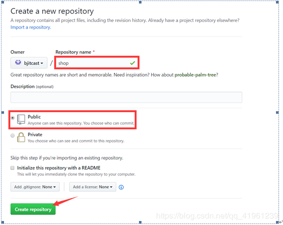

**注意：仓库名要求在当前帐号下唯一。**


#### 两种常规使用方式

#####　1、 基于http/https协议

```
a. 创建空目录，名称就称为shop

b. 使用clone指令克隆线上仓库到本地，语法：git clone 线上仓库地址

c. 在仓库上做对应的操作（提交暂存区、提交本地仓库、提交线上仓库、拉取线上仓库）
提交到线上仓库的指令：git push

```

在首次往线上仓库shop提交内容的时候出现了403的致命错误，原因是不是任何人都可以往线上仓库提交内容，必须需鉴权。(如果不加可以的话那就不加)，需要修改“.git/config”文件内容：

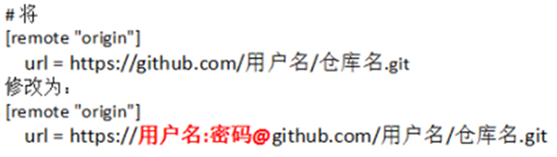


例如：

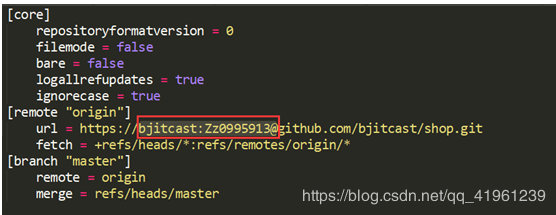


在设置好用户名密码之后再次尝试push指令：

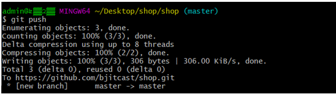


如果看到类似上述效果（没有fatal错误）则表示提交成功。

【验证】此时可以观察浏览器，刷新线上仓库的地址：

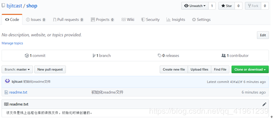


拉取线上仓库：git pull

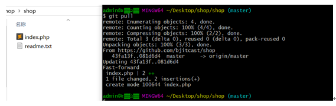


**提醒：在每天工作的第一件事就是先git pull拉取线上最新的版本；每天下班前要做的是git push，将本地代码提交到线上仓库。**


##### 2、基于ssh协议（推荐）

该方式与前面https方式相比，只是影响github对于用户的身份鉴权方式，对于git的具体操作（如提交本地、添加注释、提交远程等操作）没有任何影响。

生成公私玥对指令（需先自行安装OpenSSH）：ssh-keygen -t rsa -C “注册邮箱”

> 步骤： 
> ①生成客户端公私玥文件 
> ②将公钥上传到Github


实际操作：

①打开提示

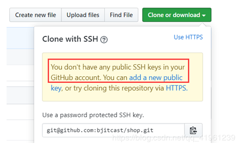

②创建公私玥对文件

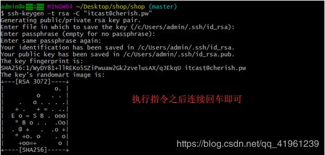


③上传公钥文件内容（id_rsa.pub）

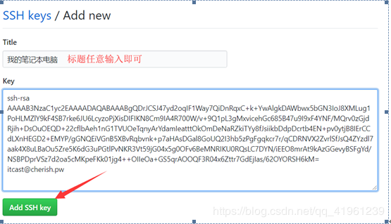


填写完毕之后保存即可。


④执行后续git操作，操作与先前一样
a. clone线上仓库到本地（git clone）

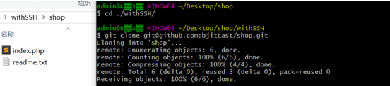

b. 修改文件后添加缓存区、提交本地仓库、提交线上仓库

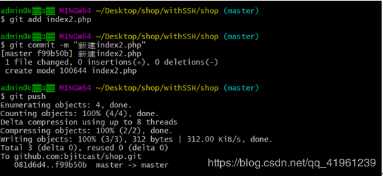

在push的时候并没有提示要求我们输入帐号密码，因为公私玥已经实现了用户身份鉴权。

线上仓库的效果：

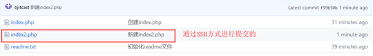

