## GatewayProxy 故障恢复

轻舟云网关组件主要有apigw- protol、istio组件、apigw-api-plane、rate-limit 等几个基本重要的组件，针对网关比较重要的组件 我们主要依赖轻舟平台内置的健康检查以及监控报警来发现错误。当出现问题之后首先排查是否是组件自身错误，如果是组件自身错误需要寻求网易人员的帮助并且帮忙解决，如果是kubernetes 自身运维问题，比如pod副本数不正确，无法调度等我们可以自身解决

### 故障排查

网关的异常排查主要从以下三点出发进行排查

- 查看轻舟云平台的网关组件健康状态
- 查看网关组件对应的报警信息
- 查看网关组件 pod 对应的请求容量（cpu、内存）


#### 1、查看轻舟云平台的网关组件健康状态

进入轻舟云管控界面，在运维管理-组件监控-API网关一栏下查看 网关对应的服务pod 是否健康

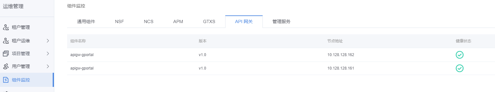

或者通过以下命令查看网关命名空间下相关的组件pod 或者副本数是否正确

```sh
# 查看网关 组件pod 期望副本数
kubectl get deployments gateway-proxy -ojson | jq '.status.replicas'

#查看网关 组件pod 实际副本数
kubectl get deployments gateway-proxy -ojson | jq '.status.availableReplicas'
```


#### 2、查看网关组件对应的报警信息

进入轻舟云管控界面，在告警服务-API网关一栏，查看网关对应的告警信息

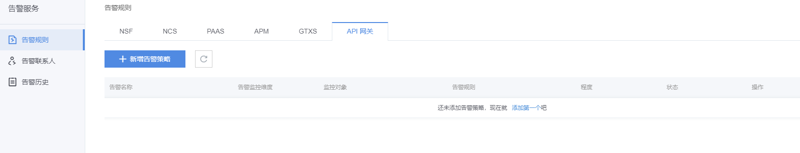


#### 3、查看网关组件 pod 对应的请求容量（cpu、内存）

通过在控制台执行以下命令查看组件Pod 申请的最小容量以及最大容量，当容量不足时，我们需要手动调节

```sh
# 查看网关 pod所需要的最小容量以及最大容量
kubectl get po gateway-proxy-pod -ojson | jq '.spec.containers[].resources'
```


### 故障修复

主要针对以下两个故障点进行演练排查修复

- GatewayProxy Pod 无法重启
- GatewayProxy Pod 容量不足 导致Pod CrashBackOff


#### 1、网关 组件pod 无法重启

第一步：查看轻舟云平台的告警邮件信息

当网关pod 副本数缩容时，我们会收到轻舟平台发送的警告邮件信息，邮件信息如下：

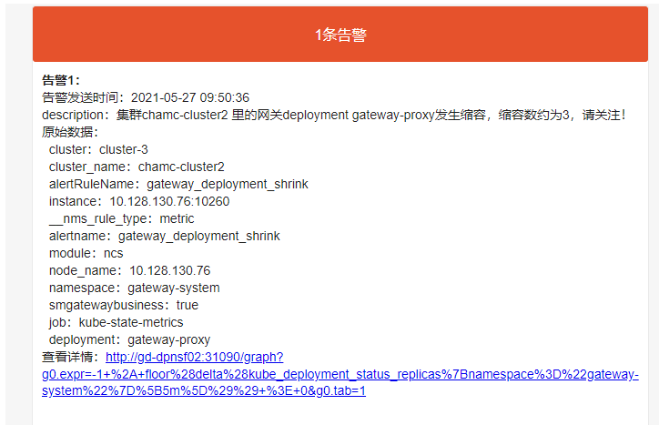


当网关pod 副本数不正确时，我们会收到轻舟平台发送的警告邮件信息，邮件信息如下：

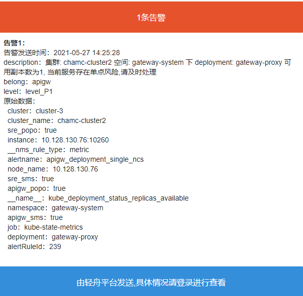


当网关pod 重新启动时，我们会收到轻舟平台发送的警告邮件信息，邮件信息如下：

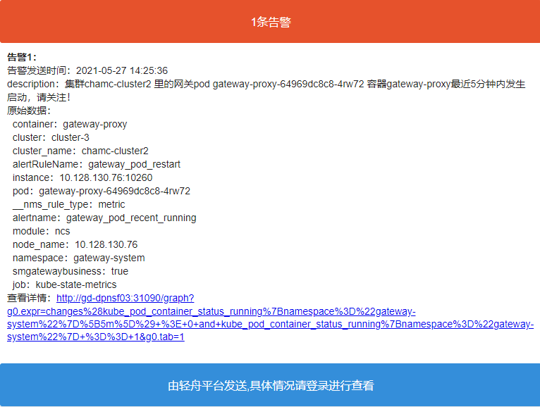


第二步：我们根据收到的具体告警邮件信息，查看网关pod相关信息，并且定位其问题

```sh
# 查看gateway proxy 控制器详细信息，并且查看控制器最近的event信息，排查为什么无法重启成功
kubectl decribe deployment gateway-proxy -n gateway-system

# 查看pod详细信息，并且查看pod最近的event信息，排查为什么无法重启成功
kubectl decribe pod gateway-proxy -n gateway-system

# 查看pod日志信息，排查为什么无法重启成功
kubectl logs gateway-proxy -n gateway-system
```


第三步：尝试将gateway-proxy的 pod 副本滚动重启

```sh
# 通过向控制器annotation添加新的字段，尝试让pod自动滚动重启
1、kubectl patch deployment testdeployment -p   "{\"spec\":{\"template\":{\"metadata\":{\"annotations\":{\"date\":\"`date +'%s'`\"}}}}}"

# 查看滚动删除的状态
2、kubectl rollout rollout status deployment
```


第四步：如果滚动重启后还是无法启动，我们通过以下命令查看pod 及其最近的事件信息

```sh
# 查看pod详细信息，并且查看pod最近的event信息，排查为什么无法重启成功
kubectl decribe pod gateway-proxy -n gateway-system
```

查看得到的信息如下：

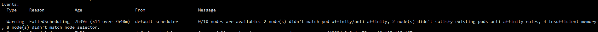

既由于当前Pod无法成功调度引起的原因，我们选择合适的节点重新为pod设置污点容忍，以保证pod可以正确的调度至节点上，设置完成后根据上面的信息进行滚动重启


#### 2、网关组件 Pod 容量不足

**第一步：查看轻舟云平台的告警邮件信息**

1、当网关pod 内存容量达到99%以上时，我们会收到轻舟平台发送的警告邮件信息，邮件信息如下：

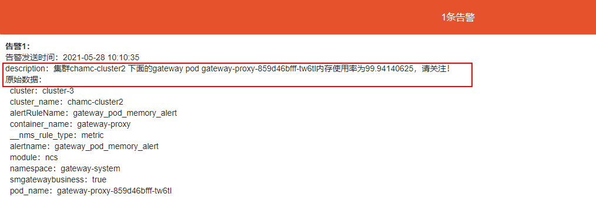


2、当网关Pod 因容量不足导致重启或者多次重启时，我们会收到轻舟平台发送的警告邮件信息，邮件信息如下：

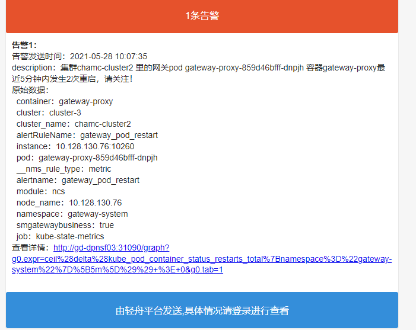


3、当网关Pod因容量不足导致无法提供服务时，我们会收到轻舟平台发送的警告邮件信息，邮件信息如下：

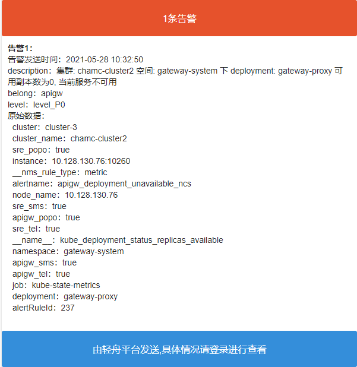


**第二步：我们根据收到的具体告警邮件信息，查看轻舟云网关以及相应Pod的具体状态**

1、当网关Pod 服务不可用时，网关无法配置路由，并且从`网关选择`下拉列表中选择该网关信息

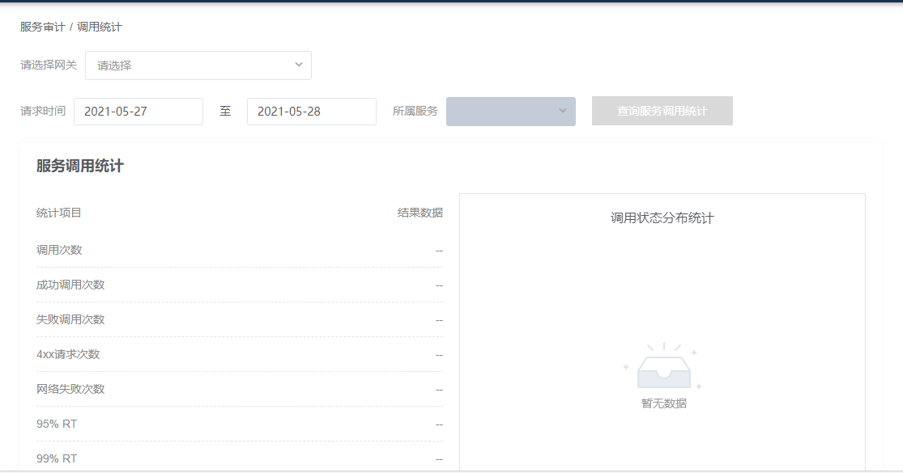

2、Pod状态为 CrashLoopBackOff，并且事件显示Pod `Liveness` 异常，`Readiness ` 异常,如下图：

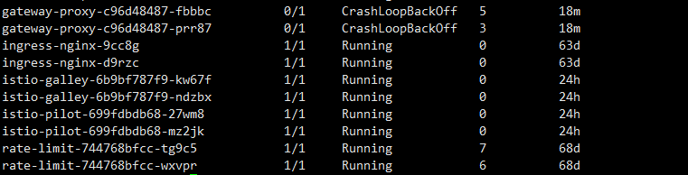

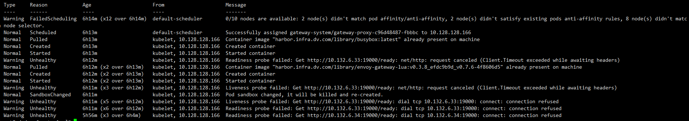


**第三步：我们根据以上信息进行问题定位，尝试调节网关Pod容量大小**

1、查看 gateway proxy pod 的容量大小

```sh
kubectl get po gateway-proxy-pod -ojson | jq '.spec.containers[].resources'
```

2、将 gateway proxy pod 的容量调高

```sh
1、 kubectl edit po gateway-proxy-pod 
2、将 PodTemplate resource 下的 request 与 limit 调节比现在大 500Mi 或者 1000Mi（根据实际情况调节）
```

3、gateway-proxy的 pod 副本滚动重启

```sh
1、当我们修改PodTemplate 的相关信息后，DeploymentController 会自动监控并且根据新的配置滚动重启gateway-proxy-pod，所以无需手动重启

# 查看滚动重启的状态
2、kubectl rollout status deployment gateway-proxy --revision=滚动之后的版本号
```

4、查看gateway-proxy pod的状态信息，出现以下信息代表重启成功

```sh
[user@k8s ~]# kubectl get po  | grep gateway
gateway-proxy-64969dc8c8-tghjp         1/1     Running   0          5h13m
gateway-proxy-64969dc8c8-tmfdg         1/1     Running   0          5h13m
```


#### 3、网关发生重大故障

当网关发生重大故障时，我们需要启动相关的备用方案，既通过F5 对请求进行路由，详见《API网关功能备用方案.xlsx》


#### 4、其他故障以及排查方法

网关关联的告警信息：《监控告警_API网关》

网关常见问题手册：《轻舟云网关常见问题》

网关其他问题运维排查手册:《轻舟云网关运维手册》