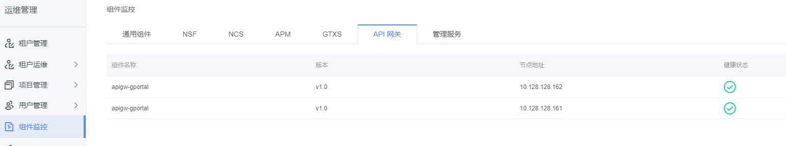
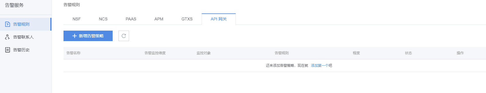
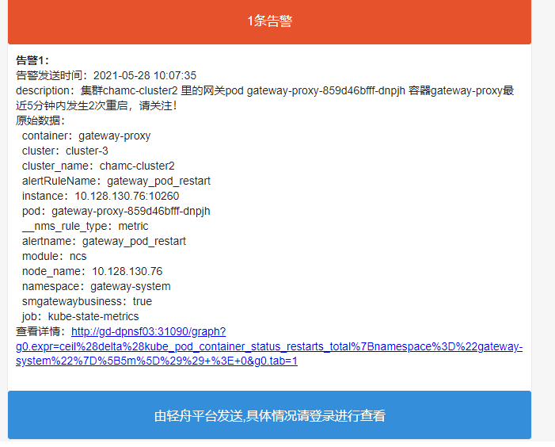
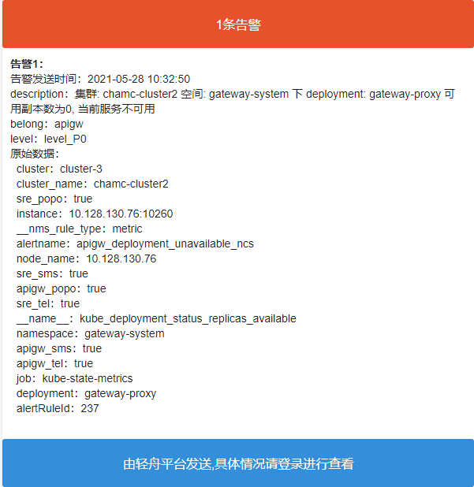
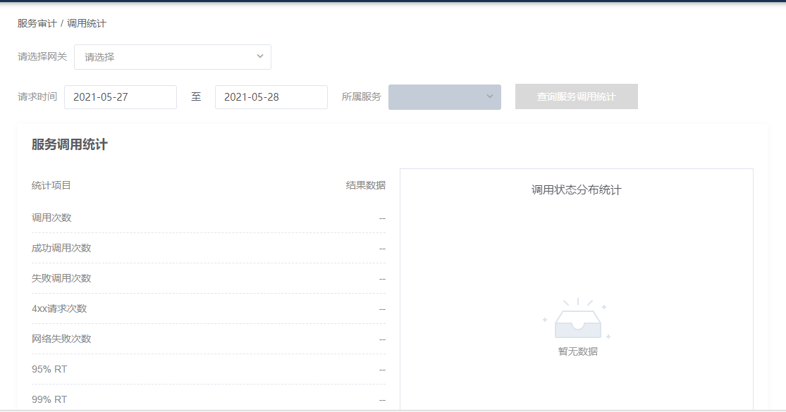
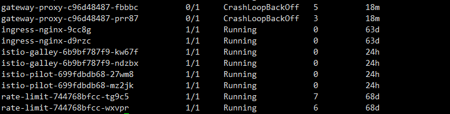

# 轻舟云平台应急演练方案

## 轻舟云平台节点

首先看一下轻舟云平台的集群节点分布如下：

- 管控集群 （10.128.38.1、10.128.38.2、10.128.38.3、10.128.38.4、10.128.38.5）
- 业务集群（10.128.38.6、10.128.38.7、10.128.38.8、10.128.38.9、10.128.38.10、10.128.38.11、10.128.38.12）
- pass 集群（10.128.39.1、10.128.39.2、10.128.39.3、10.128.38.4、10.128.39.5、10.128.39.6）


## 操作系统层面

### 操作系统宕机

#### 故障排查

1、当kubernetes 某个节点所在的宿主机宕机之后，我们会收到轻舟云平台的邮件告警信息，如下：


2、我们根据上面收到的邮件信息，查看kubernetes 集群节点的状态

```sh
kubectl get node 

NAME             STATUS     ROLES    AGE    VERSION
10.128.128.166   Ready      node     209d   v1.13.12-netease
10.128.128.167   Ready      node     209d   v1.13.12-netease
10.128.128.168   Ready      node     209d   v1.13.12-netease
10.128.128.169   Ready      node     209d   v1.13.12-netease
10.128.130.74    Ready      node     212d   v1.13.12-netease
10.128.130.75    NotReady   node     212d   v1.13.12-netease
10.128.130.76    Ready      node     212d   v1.13.12-netease
10.128.130.77    Ready      master   212d   v1.13.12-netease
10.128.130.78    Ready      master   212d   v1.13.12-netease
10.128.130.79    Ready      master   212d   v1.13.12-netease
```

通过查看kubernetes 节点，发现 10.128.130.75 这台机器当前的状态为NotReady 状态，我们将这台机器的节点 设置为不可调度状态


#### 恢复步骤

重启所在节点，等待所在节点重新启动完成，并且查看kubelet 服务是否已经启动，如果未启动，则执行 以下命令进行启动

```sh
systemctl restart kubelet
```

重启节点, 节点正常启动后， 等待5分钟左右，让服务自行恢复

如果节点无法启动, 需要迁移节点上的pod

- 设置节点不可调度

- 删除节点无法自动迁移的pod, 让 pod恢复正常, 如果pod 处理pendding状态, 参考pod 异常状态恢复


#### 恢复验证

运维人员查看操作系统宕机的所在节点状态是否为Ready状态

```sh
kubectl get node | grep NotReady
```

如果我们查不到节点状态为NotReady的 说明所有节点恢复都已经征程


### 机房断电恢复

1、首先重启kubernetes 的 master 节点，既重启 业务集群的master 节点、业务集群的master 节点、pass 集群的master 节点

2、重启 kubernetes slave 节点中的kubelet 服务，等到kubelet 服务重启成功后，分别在 管控集群、业务集群、pass 集群查看其 节点状态

3、查看节点 pod 是否正常启动成功，如果没有正常启动成功，则尝试将pod 迁移至其他节点重试


## 节点资源空间不足 

### 故障排查

1、节点磁盘空间不足或者内存资源不足

当我们创建某个pod 或者 deployment 对象时，与之关联的Pod 一直处理Pending 状态，我们通过查看其pod 相关的调度事件来定位问题, 当pod 请求 内存空间资源不足时，如下：

```sh
[root@gd-dvnsfmaster1 ~]# kubectl describe po busybox 
Name:         busybox
Namespace:    gateway-system
Node:         <none>
Labels:       run=busybox

Status:       Pending
...

Events:
  Type     Reason            Age              From               Message
  ----     ------            ----             ----               -------
  Warning  FailedScheduling  4s (x6 over 7s)  default-scheduler  0/10 nodes are available: 10 Insufficient memory.
```

通过查看其Event 事件，发现是由于内存空间不足导致，Pod 一直处于Pending 状态


### 恢复步骤

1、将Pod 请求的内存资源或者时cpu 资源设置小一点

2、增加、扩展磁盘存储空间，或者添加新的节点到k8s集群中,

3、删除所在节点生成的的日志文件，或者将日志文件外挂存储

> 注意：命令仅作为参考，namespace要根据实际部署情况决定：

``` sh
#1.1. 进入到pod中tomcat日志目录（/usr/local/tomcat/logs）
kubectl get pod ${pod_name} -n ${namespace}
kubectl exec -it ${pod_name}  bash  -n ${namespace}

#2、cd /usr/local/tomcat/logs
清空日志文件
echo ‘’ > ${log_name}.log

#3、 进入到日志文件的挂载目录进行删除
cd /外挂日志目录
echo ‘’ > ${log_name}.log
```


### 恢复验证

查看所在节点的Pod状态是否从Pending状态变为Running状态

```sh
kubectl get po --all-namespaces --field-selector="spec.nodeName=10.128.128.169"
```

如果发现有为Pending状态的Pod再具体进行定位


## 机房断电、集群节点异常

集群节点异常主要可能有以下几种可能：

- 节点网络异常
- 节点组件异常
- 节点负载过高
- 节点所在维修
- 机房断电


### 机房断电恢复

1、首先重启kubernetes 的 master 节点，既重启 业务集群的master 节点、业务集群的master 节点、pass 集群的master 节点

2、重启 kubernetes slave 节点中的kubelet 服务，等到kubelet 服务重启成功后，分别在 管控集群、业务集群、pass 集群查看其 节点状态

3、查看节点 pod 是否正常启动成功，如果没有正常启动成功，则尝试将pod 迁移至其他节点重试


## K8S 管控组件故障

### etcd 节点故障

由于etcd 采用的时Raft 协议，当etcd 集群有一半以上节点不可用事件，会导致集群变为只读状态，当我们创建 资源时，由于etcd 处于只读状态，所以kubernetes 集群对于新创建的资源将整体不可用


#### 前提

在所有变更操作之前，一定要先打个快照，以免数据丢失：

```sh
export ETCDCTL_API=3
etcdctl --endpoints ${ENDPOINT} /etc/kubernetes/${CLUSTER_NAME}/pki/etcd/ca.crt --cert /etc/kubernetes/${CLUSTER_NAME}/pki/apiserver-etcd-client.crt --key /etc/kubernetes/${CLUSTER_NAME}/pki/apiserver-etcd-client.key snapshot save snapshot.db
```


#### 操作步骤 

**1、当只挂掉一个member时，etcd集群还是能够正常读写的，但是如果再挂一个节点，etcd集群将变为只读。**

1.1、首先尝试恢复宕机的节点。（与其他节点的网络连通性正常、磁盘没有坏、docker和kubelet也正常，把manifest文件mv出来再mv回去）

1.2、如果无法恢复，那么评估一下把etcd迁移到新节点上的成本。如果有备机，那么把宕掉的member进行迁移

1.3 、如果无法本地恢复，也无法快速的进行迁移，那么就保持现状,因此，我们这边就描述一下如何迁移宕机的member。我们假如有三个member：etcd1，etcd2，etcd3， 宕掉的是etcd3，需要迁移etcd3到新的节点上。

1.4、准备好manifest文件：

主要修改以下参数：

```sh
--advertise-client-urls=https://{node-ip}:2379
--initial-advertise-peer-urls=https://{node-ip}:2380
--listen-client-urls=https://{node-ip}:2379,https://{node-ip}:2379
--listen-peer-urls=https://{node-ip}:2380
--name=${memberName}
```

修改环境变量，替换为新的成员列表

```sh
ETCD_INITIAL_CLUSTER="etcd1=https://{node-ip}:2380,etcd2=https://{node-ip}:2380,etcd3=https://{node-ip}:2380"
```

修改环境变量

```sh
ETCD_INITIAL_CLUSTER_STATE=existing
```

1.5、 在健康的节点上执行

```sh
migrate_etcd_member.sh:

#!/bin/bash
set -e
set -x
export ETCDCTL_API=3

#查询member列表
etcdctl --endpoints https://{ node-ip }:2379 --cacert /etc/kubernetes/{cluster-name}/pki/etcd/ca.crt --cert /etc/kubernetes/{cluster-name}/pki/apiserver-etcd-client.crt --key /etc/kubernetes/{cluster-name}/pki/apiserver-etcd-client.key member list 
 
#删除宕掉的member
etcdctl --endpoints https://{ node-ip }:2379 --cacert /etc/kubernetes/{cluster-name}/pki/etcd/ca.crt --cert /etc/kubernetes/{cluster-name}/pki/apiserver-etcd-client.crt --key /etc/kubernetes/{cluster-name}/pki/apiserver-etcd-client.key member remove ${memberID}
  
#添加新成员
etcdctl --endpoints https://{ node-ip }:2379 --cacert /etc/kubernetes/{cluster-name}/pki/etcd/ca.crt --cert /etc/kubernetes/{cluster-name}/pki/apiserver-etcd-client.crt --key /etc/kubernetes/{cluster-name}/pki/apiserver-etcd-client.key  member add ${memberName} --peer-urls=https://{node-ip}:2380
```

1.6、 将第一步准备好的manifest文件，放到新的节点的/etc/kubernetes/manifests/目录下

 

1.7、检查集群状态

```sh
export ETCDCTL_API=3
etcdctl --endpoints https://{ node-ip }:2379 --cacert /etc/kubernetes/{cluster-name}/pki/etcd/ca.crt --cert /etc/kubernetes/{cluster-name}/pki/apiserver-etcd-client.crt --key /etc/kubernetes/{cluster-name}/pki/apiserver-etcd-client.key endpoint health --cluster
```


1.8、 修改etcd2和etcd3的manifest文件，因为他们的 ETCD_INITIAL_CLUSTER列表已经不是新的了(这一步需要逐个操作，时刻保证至少两个member是work的)：

```sh
# 修改环境变量，替换为新的成员列表
ETCD_INITIAL_CLUSTER="etcd1=https://{ node-ip }:2380,etcd2=https://{ node-ip }:2380,etcd3=https://{ node-ip }:2380"

# 修改环境变量
ETCD_INITIAL_CLUSTER_STATE=existing
```


**2、两个member挂掉**

三节点的etcd集群，超过半数宕机以后，etcd变成只读。

2.1、首先尝试恢复另外两个节点（确保节点间网络通信没有问题，kubelet和docker正常，理论上etcd也能正常work）

2.2.、如果另外两个节点无法恢复或者恢复困难，或者节点之间的网络出现了问题，此时建议起单点的etcd集群

这里我们以如何单点恢复etcd集群为例。

2.3、准备好单节点的etcd manifest文件：

```sh
# 主要修改以下参数：
--advertise-client-urls=https://{node-ip}:2379
--initial-advertise-peer-urls=https://{node-ip}:2380
--listen-client-urls=https://{node-ip}:2379,https://{ node-ip }:2379
--listen-peer-urls=https://{node-ip}}:2380
--name=${memberName}

# 修改环境变量，替换为新的成员列表
ETCD_INITIAL_CLUSTER="etcd1=https://{node-ip}:2380"

# 修改环境变量
ETCD_INITIAL_CLUSTER_STATE=existing
```


2.4、在存活的etcd宿主机上执行：

```bash
#!/bin/bash
set -e
set -x
export ETCDCTL_API=3

# 打快照
etcdctl --endpoints https://{ node-ip }:2379 --cacert /etc/kubernetes/{cluster-name}/pki/etcd/ca.crt --cert /etc/kubernetes/{cluster-name}/pki/apiserver-etcd-client.crt --key /etc/kubernetes/{cluster-name}/pki/apiserver-etcd-client.key  snapshot save core-etcd.snap

# 停掉etcd
mv  /etc/kubernetes/manifests/{cluster-name}-etcd.yaml /etc/kubernetes/

# 等待etcd停止
sleep 5

# 备份数据到另一个目录(确认好etcd的数据目录)
mv {path}/etcd {path}/etcd-bak

# restore
etcdctl  snapshot restore core-etcd.snap --name etcd1 --initial-advertise-peer-urls https://{node-ip}:2380 --initial-cluster-token={token}  --initial-cluster etcd1=https://{node-ip}:2380  --data-dir /var/lib/etcd/  --skip-hash-check --cacert /etc/kubernetes/{cluster-name}/pki/etcd/ca.crt --cert /etc/kubernetes/{cluster-name}/pki/etcd/server.crt

# 启动
cp {cluster-name}-etcd.yaml /etc/kubernetes/manifests/

# check
sleep 5
etcdctlv3 endpoint health --cluster
```


2.5、 修改kube-apiserver的manifest文件

```sh
# 替换为新的etcd成员列表
--etcd-servers=https://{node-ip}:2379
```


**3、所有member 挂掉** 

3.1、先尝试原地恢复，确保机器启动、成员之间网络连通性没问题、kubelet和docker正常。

3.2、 如果无法原地恢复，那么就只能先快速恢复单点，单点可以在本机，如果本机不行，那就需要一台新的机器上。

3.3、 因此，我们这里就说一下如何利用snapshot单点拉起etcd集群。假设在原有的一台机器上能恢复。

3.4.、老的etcd需要全部停掉（如果有在运行的话）

```sh
mv  /etc/kubernetes/manifests/${ClusterName}-etcd.yaml /etc/kubernetes/
```


3.5、 备份数据

```sh
# 备份数据(确认好etcd的数据目录)
mv ${EtcdDataDirectory} ${EtcdDataDirectory}-bak

# 拷贝快照文件到工作目录
cp ${SnapShot} .
```


3.6、准备manifest文件

```sh
# 主要修改以下参数：
--advertise-client-urls=https://{node-ip}:2379
--initial-advertise-peer-urls=https://{node-ip}:2380
--listen-client-urls=https://{node-ip}:2379,https://{node-ip}:2379
--listen-peer-urls=https://{node-ip}}:2380
--name=${memberName}

# 修改环境变量，替换为新的成员列表
ETCD_INITIAL_CLUSTER="etcd1=https://{node-ip}:2380"

# 修改环境变量
ETCD_INITIAL_CLUSTER_STATE=existing
```


3.7、restore

```sh
etcdctl  snapshot restore ${SnapShot} --name etcd1 --initial-advertise-peer-urls https://{node-ip}:2380 --initial-cluster-token={token}  --initial-cluster etcd1=https://{node-ip}:2380  --data-dir /var/lib/etcd/  --skip-hash-check --cacert /etc/kubernetes/{cluster-name}/pki/etcd/ca.crt --cert /etc/kubernetes/{cluster-name}/pki/etcd/server.crt

# 启动
cp {cluster-name}-etcd.yaml /etc/kubernetes/manifests/

# check
etcdctlv3 endpoint health --cluster
```


3.8、修改kube-apiserver的manifest文件

```sh
# 替换为新的etcd成员列表
--etcd-servers=https://{node-ip}:2379
```


#### 恢复验证

查看etcd 节点状态是否正常，并且查看etcd的其他memeber 成员是否达到预期值

使用docker exec 进入到etcd集群中的某一个节点

```sh
docker exec -it etcd-cluster-name /bin/bash
```


然后查看etcd的集群状态如下：

```sh
ETCDCTL_API=3 etcdctl --endpoints=https://[127.0.0.1]:2379 --cacert=/etc/kubernetes/pki/etcd/ca.crt \
--cert=/etc/kubernetes/pki/etcd/healthcheck-client.crt --key=/etc/kubernetes/pki/etcd/healthcheck-client.key \
endpoint health --cluster
https://10.128.128.160:2379 is healthy: successfully committed proposal: took = 9.120586ms
https://10.128.128.161:2379 is healthy: successfully committed proposal: took = 9.355967ms
https://10.128.128
```


### 集群节点状态异常

集群节点异常主要可能有以下几种可能：

- 节点网络异常
- 节点组件异常
- 节点负载过高
- 节点所在维修

#### 节点网络异常恢复

原因：由于机房网络出错，导致master 与 实际的node节点之间网络不可达

解决方案：

- 参考节点宕机

- 通过patch 命令为 pod 设置污点容忍默认为5min，我们可以缩短为3s

  ```sh
  node.kubernetes.io/unreachable:NoExecute
  node.kubernetes.io/unreachable:NoSchedule
  ```

  


#### 节点组件异常恢复

查看 kubelet docker 服务是否有异常, 可以重启 kubelet、docker 服务尝试恢复

查看 cni 组件 pod 服务状态是否正常, 异常状态下， 可以尝试删除 pod 让其重建进行恢复

 

#### 节点负载过高恢复

原因：由于 节点资源占用过高，比如 pod 或者node 亲和性导致大量pod 都被创建在了统一节点，导致节点负载过高

通过监控查看节点load 情况, 节点负载过高导致 kubelet 心跳上报异常， 导致节点notReady

迁移节点上部分负载过高的服务

 

#### 硬件维修

原因：由于所在节点需要系统升级或者打补丁，导致系统需要重启

解决方案：通过kubectl drain 来排干所在节点的pod，并且将其设置为不可调度，当pod 排干后，停止改节点的kubelet 服务，并且进行服务升级或者维修

执行以下命令将node上所有pod驱逐

```sh
nodeName=""
kubectl drain $nodeName --delete-local-data --ignore-daemonsets
```

等待上步的node上除了daemonest外其他pod都被驱逐掉，然后关机维修硬件

当维修完成后，将节点重新上线

```sh
nodeName=""
kubectl uncordon $nodeName
```


#### 恢复验证

通过kubectl 查看集群节点的状态是否已经变为Ready状态

```sh
# 查看是否还存在节点状态为NotReady 状态的节点
kubectl get node  | grep NotReady
```


### Prometheus 监控组件异常


### Pod 故障恢复

Pod 故障 主要包括静态Pod 与 动态Pod两种，管控节点层面的静态Pod 分为 api-server、scheduler、controller-manager 等，先对pod 一些常见问题做一些总结如下：

#### 1、pod状态异常

1.1、异常状态表现

- Pending 等待调度
- Waiting | ContainerCreating
- ImagePullBackOff  拉取镜像失败
- CrashLoopBackOff 容器异常退出/健康检查失败退出
- Error 容器启动失败
- Terminating | Unknown pod所在node 节点失联
- POD 持续重启

 

1.2、问题排查

kubectl get pod <pod-name> -o yaml 查看 Pod 的配置是否正确

kubectl describe pod <pod-name> 查看 Pod 的事件

kubectl logs <pod-name> [-c <container-name>] 查看容器日志

 

1.3、恢复步骤

- Pending 持续卡在该状态， 可能原因

  资源不足，集群内所有的 Node 都不满足该 Pod 请求的 CPU、内存、GPU 等资源

  HostPort 已被占用，通常推荐使用 Service 对外开放服务端口

- Waiting | ContainerCreating 等待创建；持续处理该状态， 可能原因

  - 镜像拉取失败，比如 配置了错误的镜像

  - Kubelet 无法访问镜像（国内环境访问 gcr.io 需要特殊处理）
  - 私有镜像的密钥配置错误
  - 镜像太大，拉取超时（可以适当调整 kubelet 的 --image-pull-progress-deadline 和 --runtime-request-timeout 选项）
  - CNI 网络错误，一般需要检查 CNI 网络插件的配置：可能是无法分配IP导致

-  ImagePullBackOff 镜像拉取失败：参考镜像拉取失败

- CrashLoopBackOff 容器异常退出/健康检查失败退出
  - 查看容器日志是否有报错
  - 如果容器启动未发生错误， 则需要查看POD的健康检查是否正常

- Error 持续处于该状态， 说明 POD 启动过程中发生错误, 可能原因

  依赖的 ConfigMap、Secret 或者 PV 等不存在

  请求的资源超过了管理员设置的限制，比如超过了 LimitRange 等

  违反集群的安全策略，比如违反了 PodSecurityPolicy 等

  容器无权操作集群内的资源，比如开启 RBAC 后，需要为 ServiceAccount 配置角色绑定

- Terminating | Unknown pod所在node 节点失联

  恢复 node 节点状态， 或者迁移异常节点上的POD： 参考节点故障应急预案

- POD 持续重启，可能是POD 资源使用达到上线， 发生OOM

  查看PDO 资源 limit 配置, 调整limit 上限： 默认调整规则为 上浮50%

 

1.4、恢复验证

```sh
kubectl get pod -n <namespace> |grep  <pod_name>  状态为 Running且所有容器已经启动，无反复重启
```


1.5、静态pod 的创建与删除操作

- 如果把 pod的yaml描述文件放到 这个目录中，等kubelet扫描到文件，会自动在本机创建出来 pod；
- 如果把 pod的yaml文件更改了，kubelet也会识别到，会自动更新 pod；
- 如果把 pod的yaml文件删除了，kubelet会自动删除掉pod；
- 因为静态pod 不能被 api-server 直接管理，所以它的更新删除操作不能由 kubectl 来执行，只能直接修改或删除文本文件。


### kubernetes 管控组件异常

#### 故障排查

根据轻舟云平台的相关告警邮件，发现kubernetes 的管控组件异常邮件如下：

> 待解决


#### 恢复验证

将所在节点的相关静态Pod 文件 （文件位置在 /etc/kubernetes/mainfset 下）移动到其他目录，kubernetes 会自动删除相关的Pod资源，然后将刚刚移出的静态Pod文件再放入该文件下，等待pod 重新启动，紧接着查看其状态是否正常，这里有两点需要注意：

- apiserver 主要依赖于keepalived 实现 虚拟ip 进行漂移保证apiserver高可用
- controller-manager 与 sheduler 主要依赖于 etcd 与 endpoint 实现选主逻辑保证高可用


## 轻舟云平台组件

### GatewayProxy 故障恢复

轻舟云网关组件主要有apigw- protol、istio组件、apigw-api-plane、rate-limit 等几个基本重要的组件，针对网关比较重要的组件 我们主要依赖轻舟平台内置的健康检查以及监控报警来发现错误。当出现问题之后首先排查是否是组件自身错误，如果是组件自身错误需要寻求网易人员的帮助并且帮忙解决，如果是kubernetes 自身运维问题，比如pod副本数不正确，无法调度等我们可以自身解决

#### 故障排查

网关的异常排查主要从以下三点出发进行排查

- 查看轻舟云平台的网关组件健康状态
- 查看网关组件对应的报警信息
- 查看网关组件 pod 对应的请求容量（cpu、内存）


**1、查看轻舟云平台的网关组件健康状态**

进入轻舟云管控界面，在运维管理-组件监控-API网关一栏下查看 网关对应的服务pod 是否健康



或者通过以下命令查看网关命名空间下相关的组件pod 或者副本数是否正确

```sh
# 查看网关 组件pod 期望副本数
kubectl get deployments gateway-proxy -ojson | jq '.status.replicas'

#查看网关 组件pod 实际副本数
kubectl get deployments gateway-proxy -ojson | jq '.status.availableReplicas'
```


**2、查看网关组件对应的报警信息**

进入轻舟云管控界面，在告警服务-API网关一栏，查看网关对应的告警信息




**3、查看网关组件 pod 对应的请求容量（cpu、内存）**

通过在控制台执行以下命令查看组件Pod 申请的最小容量以及最大容量，当容量不足时，我们需要手动调节

```sh
# 查看网关 pod所需要的最小容量以及最大容量
kubectl get po gateway-proxy-pod -ojson | jq '.spec.containers[].resources'
```


#### 故障修复

主要针对以下两个故障点进行排查修复

**1、网关 组件pod 无法重启**

第一步：查看轻舟云平台的告警邮件信息

当网关pod 副本数缩容时，我们会收到轻舟平台发送的警告邮件信息，邮件信息如下：


当网关pod 副本数不正确时，我们会收到轻舟平台发送的警告邮件信息，邮件信息如下：


当网关pod 重新启动时，我们会收到轻舟平台发送的警告邮件信息，邮件信息如下：


第二步：我们根据收到的具体告警邮件信息，查看网关pod相关信息，并且定位其问题

```sh
# 查看gateway proxy 控制器详细信息，并且查看控制器最近的event信息，排查为什么无法重启成功
kubectl decribe deployment gateway-proxy -n gateway-system

# 查看pod详细信息，并且查看pod最近的event信息，排查为什么无法重启成功
kubectl decribe pod gateway-proxy -n gateway-system

# 查看pod日志信息，排查为什么无法重启成功
kubectl logs gateway-proxy -n gateway-system
```


第三步：尝试将gateway-proxy的 pod 副本滚动重启

```sh
# 通过向控制器annotation添加新的字段，尝试让pod自动滚动重启
1、kubectl patch deployment testdeployment -p   "{\"spec\":{\"template\":{\"metadata\":{\"annotations\":{\"date\":\"`date +'%s'`\"}}}}}"

# 查看滚动删除的状态
2、kubectl rollout rollout status deployment
```


第四步：如果滚动重启后还是无法启动，我们通过以下命令查看pod 及其最近的事件信息

```sh
# 查看pod详细信息，并且查看pod最近的event信息，排查为什么无法重启成功
kubectl decribe pod gateway-proxy -n gateway-system
```

查看得到的信息如下：


既由于当前Pod无法成功调度引起的原因，我们选择合适的节点重新为pod设置污点容忍，以保证pod可以正确的调度至节点上，设置完成后根据上面的信息进行滚动重启


**2、网关组件 Pod 容量不足**

**第一步：查看轻舟云平台的告警邮件信息**

1、当网关pod 内存容量达到99%以上时，我们会收到轻舟平台发送的警告邮件信息，邮件信息如下：


2、当网关Pod 因容量不足导致重启或者多次重启时，我们会收到轻舟平台发送的警告邮件信息，邮件信息如下：




3、当网关Pod因容量不足导致无法提供服务时，我们会收到轻舟平台发送的警告邮件信息，邮件信息如下：




**第二步：我们根据收到的具体告警邮件信息，查看轻舟云网关以及相应Pod的具体状态**

1、当网关Pod 服务不可用时，网关无法配置路由，并且从`网关选择`下拉列表中选择该网关信息



2、Pod状态为 CrashLoopBackOff，并且事件显示Pod `Liveness` 异常，`Readiness ` 异常,如下图：




**第三步：我们根据以上信息进行问题定位，尝试调节网关Pod容量大小**

1、查看 gateway proxy pod 的容量大小

```sh
kubectl get po gateway-proxy-pod -ojson | jq '.spec.containers[].resources'
```

2、将 gateway proxy pod 的容量调高

```sh
1、 kubectl edit po gateway-proxy-pod 
2、将 PodTemplate resource 下的 request 与 limit 调节比现在大 500Mi 或者 1000Mi（根据实际情况调节）
```

3、gateway-proxy的 pod 副本滚动重启

```sh
1、当我们修改PodTemplate 的相关信息后，DeploymentController 会自动监控并且根据新的配置滚动重启gateway-proxy-pod，所以无需手动重启

# 查看滚动重启的状态
2、kubectl rollout status deployment gateway-proxy --revision=滚动之后的版本号
```

4、查看gateway-proxy pod的状态信息，出现以下信息代表重启成功

```sh
[user@k8s ~]# kubectl get po  | grep gateway
gateway-proxy-64969dc8c8-tghjp         1/1     Running   0          5h13m
gateway-proxy-64969dc8c8-tmfdg         1/1     Running   0          5h13m
```


**3、网关发生重大故障**

当网关发生重大故障时，我们需要启动相关的备用方案，既通过F5 对请求进行路由，详见《API网关功能备用方案.xlsx》


**4、其他故障以及排查方法**

网关关联的告警信息：《监控告警_API网关》

网关常见问题手册：《轻舟云网关常见问题》

网关其他问题运维排查手册:《轻舟云网关运维手册》


#### 恢复验证

查看网关相关的Pod节点是否为Running 状态

```sh
kubectl get po -n gateway-system | grep gateway-proxy | grep -v Running
```


### NSF 故障恢复

轻舟云网关组件主要在skiff-ns 命名空间下，包括有apollo、redis、registry、etcd，nsf-server、trubine 等组件， 我们主要依赖轻舟平台内置的健康检查以及监控报警来发现错误。当出现问题之后首先排查是否是组件自身错误，如果是组件自身错误需要寻求网易人员的帮助并且帮忙解决，如果是kubernetes 自身运维问题，比如pod副本数不正确，无法调度等我们可以自身解决

#### 故障排查

网关的异常排查主要从以下三点出发进行排查

- 查看轻舟云平台的NSF组件健康状态
- 查看NSF组件的报警信息
- 查看NSF 相关的日志信息


**1、查看轻舟云平台的网关组件健康状态**

进入轻舟云管控界面，在运维管理-组件监控-NSF一栏下查看 网关对应的服务pod 是否健康


或者通过以下命令查看NSF命名空间下相关的组件pod 或者副本数是否正确

```sh
# 查看NSF 组件下的所有deployments控制器
kubectl get deployments -n skiff-nsf

# 查看NSF 组件下的所有Stateful控制器
kubectl get statefulsets -n skiff-nsf

#查看NSF 组件pod 实际副本数
kubectl get {controller} {controller_name} -ojson | jq '.status.availableReplicas'
```

在NSF 下主要包括两种控制器，分别为Deployment 控制器创建的Pod 与 StatefulSet 创建的Pod，如下：

deployments 控制器，对应组件如下：

- Apollo 相关
  - admin
  - portal
  - service
- nsf-server

statefulset 创建的Pod如下：

- nsf-redis
- nsf-redis-exporter
- nsf-sentinel
- nsf-trunel-server
- nsf-turbine
- nsf-registry

我们可以根据以上组件进行实际的排查


**2、查看网关组件对应的报警信息**

进入轻舟云管控界面，在告警服务-API网关一栏，查看NSF对应的告警信息


**3、查看NSF组件 pod 对应的请求容量（cpu、内存）**

通过我们上面列出的关于NSF组件相关的控制器，然后定位到某个Pod信息，通过在控制台执行以下命令查看组件Pod 申请的最小容量以及最大容量，当容量不足时，我们需要手动调节

```sh
# 查看网关 pod所需要的最小容量以及最大容量
kubectl get {controller} {controller_name} -ojson | jq '.spec.containers[].resources'
```


#### 故障修复

主要针对以下两个故障点进行排查修复

**1、nsf-server pod 副本数为单副本或者发生副本缩容时**

第一步：查看轻舟云平台的告警邮件信息

当网关pod 副本数缩容时，我们会收到轻舟平台发送的警告邮件信息，邮件信息如下：


当网关pod 副本数不正确时，我们会收到轻舟平台发送的警告邮件信息，邮件信息如下：


第二步：我们根据收到的具体告警邮件信息，查看nsf-server相关信息，并且定位其问题

```sh
# 查看nsf-server 控制器详细信息，并且查看控制器最近的event信息，排查为什么无法重启成功
kubectl decribe deployment nsf-server -n skiff-nsf

# 查看pod详细信息，并且查看pod最近的event信息，排查为什么无法重启成功
kubectl decribe pod nsf-server -n skiff-nsf

# 查看pod日志信息，排查为什么无法重启成功
kubectl logs nsf-server -n skiff-nsf
```


第三步：尝试将nsf-server 控制器相关的 pod 副本滚动重启

```sh
# 通过向控制器annotation添加新的字段，尝试让pod自动滚动重启
1、kubectl patch deployment nsf-server -p   "{\"spec\":{\"template\":{\"metadata\":{\"annotations\":{\"date\":\"`date +'%s'`\"}}}}}"

# 查看滚动删除的状态
2、kubectl rollout status deployment nfs-server
```


**2、NSF组件 Pod 容量不足**

**第一步：查看轻舟云平台的告警邮件信息**

1、当网关pod 内存容量达到99%或者tomcat 响应时间过长时，我们会收到轻舟平台发送的警告邮件信息，邮件信息如下：


**第二步：我们根据收到的具体告警邮件信息，查看轻舟云网关以及相应Pod的具体状态**

1、当NSF Pod 服务不可用时，NSF 则无法统计微服务的节点信息，一级查看服务状态


**第三步：我们根据以上信息进行问题定位，尝试调节网关Pod容量大小**

1、查看 nsf-server pod 的容量大小

```sh
kubectl get po nsf-server -ojson | jq '.spec.containers[].resources'
```

2、将 nsf-server pod 的容量调高

```sh
1、 kubectl edit po nsf-server
2、将 PodTemplate resource 下的 request 与 limit 调节比现在大 500Mi 或者 1000Mi（根据实际情况调节）
```

3、nsf-server的 pod 副本滚动重启

```sh
1、当我们修改PodTemplate 的相关信息后，DeploymentController 会自动监控并且根据新的配置滚动重启nsf-server-pod，所以无需手动重启

# 查看滚动重启的状态
2、kubectl rollout status deployment nsf-server --revision=滚动之后的版本号
```

4、查看nsf-server pod的状态信息，出现以下信息代表重启成功

```sh
[user@k8s ~]# kubectl get po  | grep nsf-server
nsf-server-64969dc8c8-tghjp         1/1     Running   0          5h13m
nsf-server-64969dc8c8-tmfdg         1/1     Running   0          5h13m
```


#### 恢复验证

查看nsf controller、registry statefulset 控制器对应的pod 状态是否为Running 状态并且副本数是否达到预期值

```sh
# 查看状态不为Running 状态的Pod
kubectl get po -n skiff-nsf | grep -E "^controller_name" | grep -v Running

# 查看controller的预期值与实际副本值是否相等
kubectl get deploy nsf-server -n skiff-nsf 
kubectl get deploy nsf-server -n skiff-nsf -ojson | jq ".status"
```


