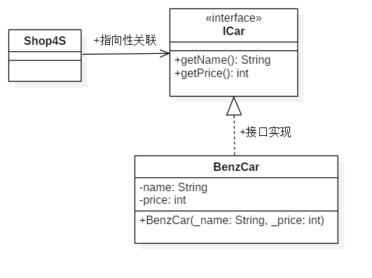
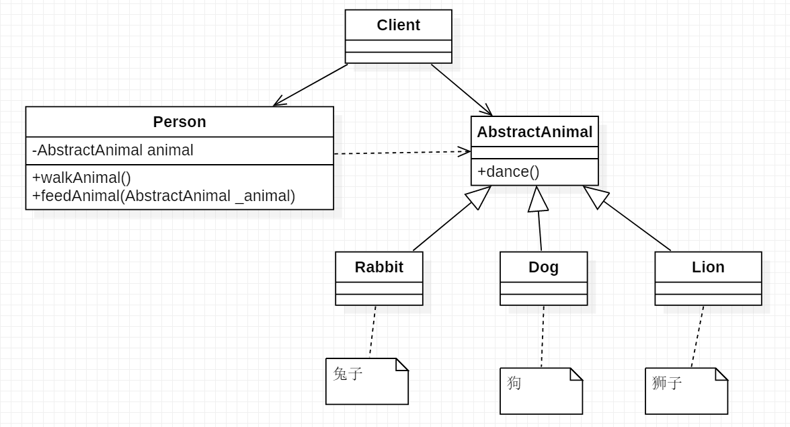
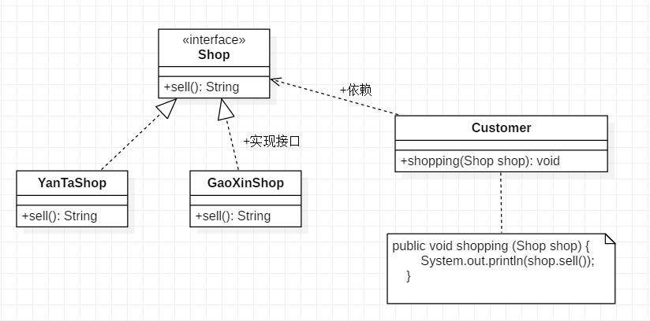
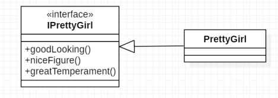
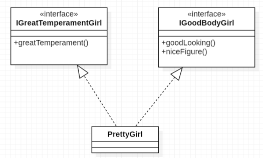
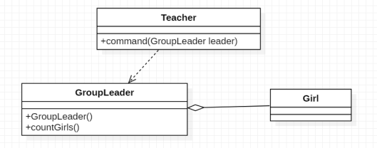
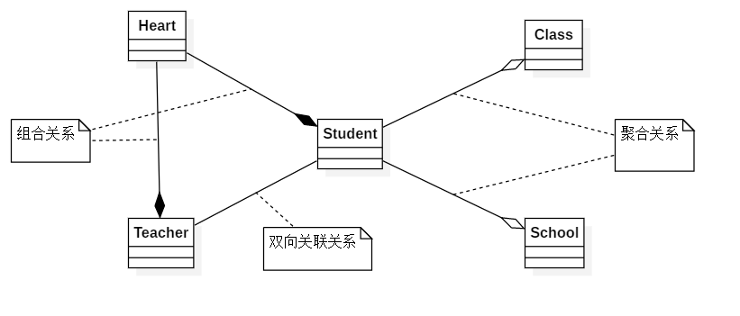

## 设计模式七大原则


### 开闭原则

 **开闭原则是设计模式中的总原则，开闭原则就是说：对拓展开放、对修改关闭。** 模块应该在尽量不修改代码的前提下进行拓展，这就需要使用接口和抽象类来实现预期效果。 

 以 4s 店销售汽车为例，其类图如图所示： 

  

在 Shop4S 类中，使用 static 代码块来模拟数据初始化过程，使用私有变量集合 carList 来记录所有售出车辆信息，一般项目中这部分都由持久化曾来完成，运行效果如下：

```java
4s店售车记录:
车名：梅赛德斯-迈巴赫S级轿车 价格：138万元
车名：梅赛德斯-AMG S 63 L 4MATIC+  价格：230万元
车名：梅赛德斯-奔驰V级  价格：50万元
```

暂时来看，以上设计是没有啥问题的。但是，某一天，4s 店老板说奔驰轿车统一要收取一笔金融服务费，收取规则是价格在 100 万元以上的收取 5%，50~100 万元的收取 2%，其余不收取。为了应对这种需求变化，之前的设计又该如何呢？

目前，解决方案大致有如下三种：

- 修改 ICar 接口：在 ICar 接口上加一个 getPriceWithFinance 接口，专门获取加上金融服务费后的价格信息。这样的后果是，实现类 BenzCar 也要修改，业务类 Shop4S 也要做相应调整。ICar 接口一般应该是足够稳定的，不应频繁修改，否则就失去了接口锲约性了。
- 修改 BenzCar 实现类：直接修改 BenzCar 类的 getPrice 方法，添加金融服务费的处理。这样的一个直接后果就是，之前依赖 getPrice 的业务模块的业务逻辑就发生了改变了，price 也不是之前的 price 了。
- 使用子类拓展来实现：增加子类 FinanceBenzCar，覆写父类 BenzCar 的 getPrice 方法，实现金融服务费相关逻辑处理。这样的好处是：只需要调整 Shop4S 中的静态模块区中的代码，main 中的逻辑是不用做任何修改的。

修改后的 FinanceBenzCar 类代码清单如下：

```java
public class FinanceBenzCar extends BenzCar{
    public FinanceBenzCar(String _name, int _price) {
        super(_name, _price);
    }

    // 覆写价格信息
    @Override
    public int getPrice() {
        // 获取原价
        int selfPrice = super.getPrice();
        int financePrice = 0;
        if (selfPrice >= 100) {
            financePrice = selfPrice + selfPrice * 5 / 100; // 收取5%的金融服务费
        } else if (selfPrice >= 50) {
            financePrice = selfPrice + selfPrice * 2 / 100; // 收取2%的金融服务费
        } else {
            financePrice = selfPrice; // 其余不收取服务费
        }
        return financePrice;
    }
 }
```

再来看看修改后的 Shop4S 类代码清单如下：

```java
import java.util.ArrayList;

public class Shop4S {

    private final static ArrayList<ICar> carList = new ArrayList<ICar>();
    private final static ArrayList<ICar> financeCarList = new ArrayList<ICar>();
    // 使用static代码块模拟数据初始化操作
    static {
        carList.add(new BenzCar("梅赛德斯-迈巴赫S级轿车",138));
        carList.add(new BenzCar("梅赛德斯-AMG S 63 L 4MATIC+", 230));
        carList.add(new BenzCar("梅赛德斯-奔驰V级", 50));
        financeCarList.add(new FinanceBenzCar("梅赛德斯-迈巴赫S级轿车",138));
        financeCarList.add(new FinanceBenzCar("梅赛德斯-AMG S 63 L 4MATIC+", 230));
        financeCarList.add(new FinanceBenzCar("梅赛德斯-奔驰V级", 50));
    }

    public static void main(String[] args) {
        System.out.println("4s店售车记录（不含金融服务费）:");
        for (ICar car: carList){
            System.out.println("车名：" + car.getName() + "\t价格：" + car.getPrice() + "万元");
        }
        System.out.println("\n4s店售车记录（包含金融服务费）:");
        for (ICar car: financeCarList) {
            System.out.println("车名：" + car.getName() + "\t价格：" + car.getPrice() + "万元");
        }
    }

}
```

运行效果如下：

```java
4s店售车记录（不含金融服务费）:
车名：梅赛德斯-迈巴赫S级轿车 价格：138万元
车名：梅赛德斯-AMG S 63 L 4MATIC+  价格：230万元
车名：梅赛德斯-奔驰V级  价格：50万元

4s店售车记录（包含金融服务费）:
车名：梅赛德斯-迈巴赫S级轿车 价格：144万元
车名：梅赛德斯-AMG S 63 L 4MATIC+  价格：241万元
车名：梅赛德斯-奔驰V级  价格：51万元
```

这样，在业务规则发生改变的情况下，我们通过拓展子类及修改持久层（高层次模块）便足以应对多变的需求。**开闭原则要求我们尽可能通过拓展来实现变化，尽可能少地改变已有模块，特别是底层模块。**

开闭原则总结：

- **提高代码复用性**
- **提高代码的可维护性**


### 里氏替换原则

**里氏替换原则的解释是，所有引用基类的地方必须能透明地使用其子类的对象。** 通俗来讲的话，就是说，只要父类能出现的地方子类就可以出现，并且使用子类替换掉父类的话，不会产生任何异常或错误，使用者可能根本就不需要知道是父类还是子类。反过来就不行了，有子类的地方不一定能使用父类替换。

比如某个方法接受一个 Map 型参数，那么它一定可以接受 HashMap、LinkedHashMap 等参数，但是反过来的话，一个接受 HashMap 的方法不一定能接受所有 Map 类型参数。

**里氏替换原则是开闭原则的实现基础，它告诉我们设计程序的时候尽可能使用基类进行对象的定义及引用，具体运行时再决定基类对应的具体子类型。**

接下来举个栗子，我们定义一个抽象类 AbstractAnimal 对象，该对象声明内部方法 “跳舞”，其中，Rabbit、Dog、Lion 分别继承该对象，另外声明一个 Person 类，该类负责喂养各种动物，Client 类负责逻辑调用，类图如下：

其中，Person 类代码如下：

```java
public class Person {
    private AbstractAnimal animal;

    public void feedAnimal(AbstractAnimal _animal) {
        this.animal = _animal;
    }

    public void walkAnimal(){
        System.out.println("人开始溜动物...");
        animal.dance();
    }
}
```

main 函数调用的时候如下：

```java
public class Main {

    public static void main(String[] args) {
        Person person = new Person();
        person.feedAnimal(new Rabbit());
        person.walkAnimal();
    }
}
```

打印输出：

> 人开始溜动物…
> 小白兔跳舞…

这里，Person 类中本该出现的父类 AbstractAnimal 我们运行时使用具体子类代替，只要是父类能出现的地方子类就能出现，这就要求我们模块设计时尽量以基类进行对象的定义及应用。

里氏替换原则总结：

- **里氏替换可以提高代码复用性，子类继承父类时自然继承到了父类的属性和方法**
- **提高代码可拓展性，子类通过实现父类方法进行功能拓展，个性化定制**
- **里氏替换中的继承有侵入性。继承，就必然拥有父类的属性和方法**
- **增加了代码的耦合性。父类方法或属性的变更，需要考虑子类所引发的变更**


### 单一职责

单一职责原则，简单来说就是保证设计类、接口、方法时做到功能单一，权责明确。怎么理解呢？比如应用开发时经常会有修改用户信息的接口，如下：这里我们定义 “更新用户” 的接口，倘若有一天新来的前端要求加一个修改用户密码的接口，后端直接说：“你去调 updateUser ” 接口吧，传入密码信息就行。这种后端往往不是太懒就是新手，updateUser 接口的粒度太粗，接口职责不够单一，所以应该将接口拆分为各个细分接口，比如修改如下：


这里很明显，我们看到分拆后的接口职责更加单一，权责更加清楚，日后维护开发也更加便捷。

**单一职责原则，指的是一个类或者模块有且只有一个改变的原因。** 如果模块或类承担的职责过多，就等于这些职责耦合在一起，这样一个模块的变快可能会削弱或抑制其它模块的能力，这样的耦合是十分脆弱地。所以应该尽量保持单一职责原则，此原则的核心就是解耦和增强内聚性。

在现在流行的微服务架构体系中，最头疼的就是服务拆分，拆分的粒度也很有讲究，标准的应该是遵从单一原则，避免服务拆分时发生各种撕逼行为：” 本应该在 A 服务中的被安排在了 B 服务中 “，所以服务的职责划分尤为重要。

再有就是，做 service 层开发时，早期的开发人员会将数据库操作放在 service 中，比如 getConnection，然后执行 prepareStatement，再就是 service 逻辑处理等等。可是后来发现数据库要由原来的 mysql 变更为 oracle，service 层代码岂不是需要重写一遍，天了噜… 直接崩溃跑路。

” 我单纯，所以我快乐 “用来形容单一职责原则再恰当不过了。

单一职责原则总结：

- **单一职责可以降低类的复杂性，提高代码可读性、可维护性**
- **但是用 “职责” 或 “变化原因” 来衡量接口或类设计得是否优良，但是 “职责” 和 “变化原因” 都是不可度量的，因项目、环境、而异；指责划分稍微不当，很容易造成资源浪费，代码量增多，好比微服务时服务边界拆分不清**


### 依赖倒置

**依赖倒置原则的定义：程序要依赖于抽象接口，不要依赖于具体实现。简单的说就是要求对抽象进行编程，不要对实现进行编程**，这样就降低了客户与实现模块间的耦合。

依赖倒置原则要求我们在程序代码中传递参数时或在关联关系中，尽量引用层次高的抽象层类，即使用接口和抽象类进行变量类型声明、参数类型声明、方法返回类型声明，以及数据类型的转换等，而不要用具体类来做这些事情。

依赖倒置原则，高层模块不应该依赖低层模块，都应该依赖抽象。抽象不应该依赖细节，细节应该依赖抽象。**其核心思想是：要面向接口编程，不要面向实现编程。**

举个栗子，拿顾客商店购物来说，定义顾客类如下，包含一个 shopping 方法：

```java
public class Customer {
    public void shopping (YanTaShop shop) {
        System.out.println(shop.sell());
    }
}
```

以上表示顾客在 "雁塔店" 进行购物，假如再加入一个新的店铺 "高新店"，表示修改如下：

```java
public class Customer {
    public void shopping (GaoXinShop shop) {
        System.out.println(shop.sell());
    }
}
```

这显然是设计不合理的，违背了开闭原则。同时，顾客类的设计和店铺类绑定了，违背了依赖倒置原则。解决办法很简单，将 Shop 抽象为具体接口，shopping 入参使用接口形式，顾客类面向接口编程，如下：

```java
public class Customer {
    public void shopping (Shop shop) {
        System.out.println(shop.sell());
    }
}

interface Shop{
    String sell();
}
```

类图关系如下：

依赖倒置原则总结：

- **高层模块不应该依赖低层模块，都应该依赖抽象（接口或抽象类）**
- **接口或抽象类不应该依赖于实现类**
- **实现类应该依赖于接口或抽象类**


### 接口隔离原则

**接口隔离原则（Interface Segregation Principle，ISP）的定义是客户端不应该依赖它不需要的接口，类间的依赖关系应该建立在最小的接口上。** 简单来说就是建立单一的接口，不要建立臃肿庞大的接口。也就是接口尽量细化，同时接口中的方法尽量少，保持接口纯洁性。

我们所讲的接口主要分为两大类，一是实例接口，比如使用 new 关键字产生一种实例，被 new 的类就是实例类的接口。从这个角度出发的话，java 中的类其实也是一种接口。二是类接口，java 中常常使用 interface 关键字定义。

举个栗子来说，我们使用接口 IPrettyGirl 来描述美女，刚开始类图可能描述如下：


但是发现该接口中包含对美女的外观描述、内在美描述等，几乎将美女的所有特性全部纳入，这显然不是一个很好的设计规范，比如在唐朝，在那个以丰腴为美的时代对美的理解就不同，就会出现单纯 goodLooking 过关就是美女的结果，所以这里我们需要将接口隔离拆分。将一个接口拓展为两个，增加系统灵活性及可维护性。
这里我们将美女接口拆分为内在美、外在美两个接口，系统灵活性提高了，另外接口间还能使用继承实现聚合，系统拓展性也得到了增强。

接口隔离原则总结：

- 接口尽量粒度化，保持接口纯洁性
- 接口要高内聚，即减少对外交互


### 迪米特法则

迪米特法则（Law of Demeter，LOD），有时候也叫做最少知识原则（Least Knowledge Principle，LKP），它的定义是：一个软件实体应当尽可能少地与其它实体发生相互作用。**迪米特法则的初衷在于降低类之间的耦合。**

举个栗子，拿教师点名来讲，体育老师需要清点班上学生人数，教师一般不是自己亲自去数，而是委托组长或班长等人去清点，即教师通过下达命令至班长要求清点人数：

```java
public class Girl {

}

public class GroupLeader {

    private final List<Girl> girls;

    public GroupLeader(List<Girl> girls) {
        this.girls = girls;
    }

    public void countGirls() {
        System.out.println("The sum of girls is " + girls.size());
    }
}

public class Teacher {

    public void command(GroupLeader leader){
        leader.countGirls();
    }
}

public class Main {

    public static void main(String[] args) throws Exception {
        Teacher teacher = new Teacher();
        GroupLeader groupLeader = new GroupLeader(Arrays.asList(new Girl(), new Girl()));
        teacher.command(groupLeader);
    }
}
```



上述例子中，如果去掉 GroupLeader 这个中间人角色，教师就会直接去清点人数，这样做会违反迪米特法则。

迪米特法则总结：

- 类定义时尽量内敛，少使用 public 权限修饰符，尽量使用 private、protected 等。


### 合成复用原则

**合成复用原则是通过将已有的对象纳入新对象中，作为新对象的成员对象来实现的，新对象可以调用已有对象的功能，从而达到复用。** 原则是尽量首先使用合成 / 聚合的方式，而不是使用继承。

合成和聚合都是关联的特殊种类。合成是值的聚合（**Aggregation by Value**），而复合是引用的聚合（**Aggregation by Reference**）。

都知道，**类之间有三种基本关系，分别是：关联（聚合和组合）、泛化（与继承同一概念）、依赖。**

这里我们提一下关联关系，客观来讲，大千世界中的两个实体之间总是有着千丝万缕的关系，归纳到软件系统中就是两个类之间必然存在关联关系。如果一个类单向依赖另一个类，那么它们之间就是单向关联。如果彼此依赖，则为相互依赖，即双向关联。

关联关系包括两种特例：聚合和组合。聚合，用来表示整体与部分的关系或者 “拥有” 关系。其中，代表部分的对象可能会被代表多个整体的对象所拥有，但是并不一定会随着整体对象的销毁而销毁，部分的生命周期可能会超越整体。好比班级和学生，班级销毁或解散后学生还是存在的，学生可以继续存在某个培训机构或步入社会，生命周期不同于班级甚至大于班级。

合成，用来表示一种强得多的 “拥有” 关系。其中，部分和整体的生命周期是一致的，一个合成的新的对象完全拥有对其组成部分的支配权，包括创建和泯灭。好比人的各个器官组成人一样，一旦某个器官衰竭，人也不复存在，这是一种 “强” 关联。



如上图所示，Heart 和 Student、Teacher 都是一种 “强” 关联，人不能摆脱心脏而存在，即组合关系，而 Student 和 Class、School 是一种 “弱” 关联，脱离了学校、班级，学生还能属于社会或其他团体，即聚合关系。

合成复用原则总结：

- 新对象可以调用已有对象的功能，从而达到对象复用

  


### 总结

各种原则要求的侧重点不同，总地来说：

1、开闭原则是核心，对拓展开放对修改关闭是软件设计、后期拓展的基石；

2、单一职责原则就要求我们设计接口，制定模块功能时保持模块或者接口功能单一，接口设计或功能设计尽量保持原子性，修改一处不能影响全局或其它模块；

3、里氏替换原则和依赖倒置原则，按照作者的理解，这俩原则总的是要求我们要面向接口、面向抽象编程，设计程序的时候尽可能使用基类或者接口进行对象的定义或引用，而不是具体的实现，否则实现一旦有变更，上层调用者就必须做出对应变更，这样一来，整个模块可能都需要重新调整，非常不利于后期拓展。

4、接口隔离原则具体应用到程序中，比如我们在传统 mvc 开发时，service 层调用 dao 层一般会使用接口进行调用，各层之间尽量面向接口通信，其实也是一种降低模块耦合的方法；

5、迪米特法则的初衷也是为了降低模块耦合，代码示例中我们引入了类似 “中间人” 的概念，上层模块不直接调用下层模块，而是引入第三方进行代办，这也是为了降低模块的耦合度；

6、合成复用原则一节，我们介绍了聚合、组合的概念，聚合是一种弱关联，而组合是一种强关联，表现在 UML 类图上的话聚合是使用空心四边形加箭头表示，而组合是使用实心四边形加箭头表示，合成复用原则总的就是要求我们尽量利用好已有对象，从而达到功能复用，具体是聚合还是组合，还是一般关联，就要看具体情况再定了。