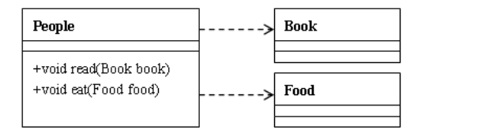
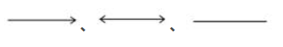
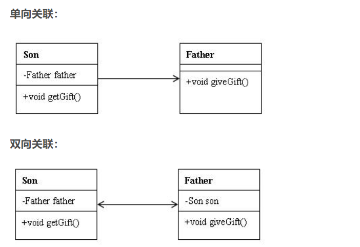
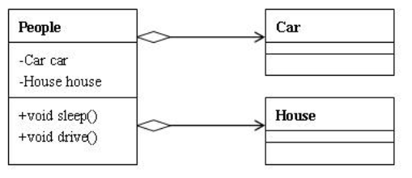
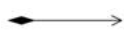
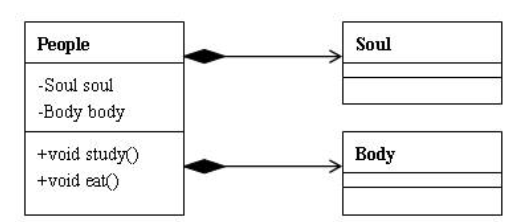
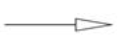
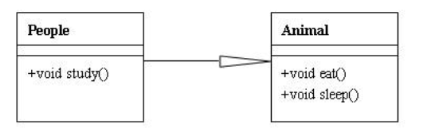
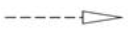
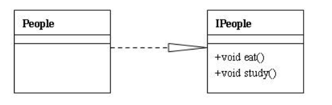

## UML类图 

### 类图中的关联关系

 在java以及其他的面向对象设计模式中，类与类之间主要有6种关系，他们分别是：依赖、关联、聚合、组合、继承、实现。他们的耦合度依次增强。 

**1. 依赖（Dependence）**



​    依赖关系的定义为：对于两个相对独立的对象，当一个对象负责构造另一个对象的实例，或者依赖另一个对象的服务时，这两个对象之间主要体现为依赖关系。定义比较晦涩难懂，但在java中的表现还是比较直观的：类A当中使用了类B，其中类B是作为类A的方法参数、方法中的局部变量、或者静态方法调用。类上面的图例中：People类依赖于Book类和Food类，Book类和Food类是作为类中方法的参数形式出现在People类中的。总的来说就是只要在类中用到了对方，那么他们之间就存在依赖关系


**2、关联** 



 对于两个相对独立的对象，当一个对象的实例与另一个对象的一些特定实例存在固定的对应关系时，这两个对象之间为关联关系。关联关系分为单向关联和双向关联。在java中，单向关联表现为：类A当中使用了类B，其中类B是作为类A的成员变量。双向关联表现为：类A当中使用了类B作为成员变量；同时类B中也使用了类A作为成员变量。 


**3. 聚合** 

  聚合关系是关联关系的一种，耦合度强于关联，他们的代码表现是相同的，仅仅是在语义上有所区别：关联关系的对象间是相互独立的，而聚合关系的对象之间存在着包容关系，他们之间是“整体-个体”的相互关系。 



UML 本身是一套符号的规定，这些符号用于描述软件模型中各个元素和他们的关系，比如类、接口、实现、泛化、依赖、组合、聚合

```
public class People{
    Car car;
    House house; 
    //聚合关系中作为成员变量的类一般使用set方法赋值
     public void setCar(Car car){
        This.car = car;
    }
    public void setHouse(House house){
        This.house = house;
    }
 
    public void driver(){
        System.out.println(“车的型号：”+car.getType());
    }
    public void sleep(){
        System.out.println(“我在房子里睡觉：”+house.getAddress());
    }
}
```


 **4.组合（Composition）**



 相比于聚合，组合是一种耦合度更强的关联关系。存在组合关系的类表示“整体-部分”的关联关系，“整体”负责“部分”的生命周期，他们之间是共生共死的；并且“部分”单独存在时没有任何意义。在下图的例子中，People与Soul、Body之间是组合关系，当人的生命周期开始时，必须同时有灵魂和肉体；当人的生命周期结束时，灵魂肉体随之消亡；无论是灵魂还是肉体，都不能单独存在，他们必须作为人的组成部分存在。 

```

Public class People{
    Soul soul;
    Body body; 
    //组合关系中的成员变量一般会在构造方法中赋值
     Public People(Soul soul, Body body){ 
        This.soul = soul;
        This.body = body;
    }
 
    Public void study(){
        System.out.println(“学习要用灵魂”+soul.getName());
    }
    Public void eat(){
        System.out.println(“吃饭用身体：”+body.getName());
    }
}
```


 **5.继承（Generalization）** 



 继承表示类与类（或者接口与接口）之间的父子关系。在java中，用关键字extends表示继承关系。UML图例中，继承关系用实线+空心箭头表示，箭头指向父类。 


 **6.实现（Implementation）** 



 表示一个类实现一个或多个接口的方法。接口定义好操作的集合，由实现类去完成接口的具体操作。在java中使用implements表示。UML图例中，实现关系用虚线+空心箭头表示，箭头指向接口。 