## PlantUML 

plantUml 提供了多种uml种类图，比如时序图，用例图，类图、活动图等等

官方中文网址： https://plantuml.com/zh/class-diagram 


### 类与类之间的关系

 类之间的关系通过下面的符号定义 : 

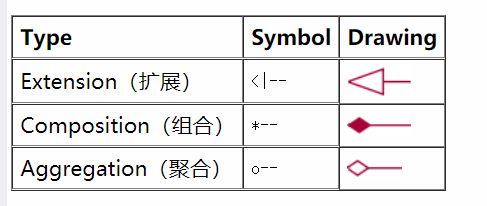

 使用`..` 来代替 `--` 可以得到点 线. 

```
-- 代表的是当前类的子级
- 代表的是同级
.. 代表的是子级
. 代表的是同级

->  代表的是
*-- 代表组合
o-- 代表聚合

-|> 代表扩展
```


示例如下：

```
@startuml
Class01 <|-- Class02
Class03 *-- Class04
Class05 o-- Class06
Class07 .. Class08
Class09 -- Class10
@enduml
```

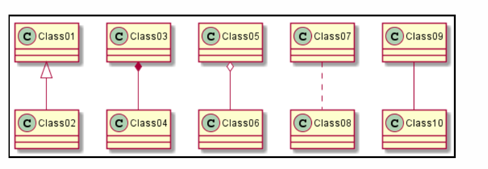


```
@startuml
Class11 <|.. Class12
Class13 --> Class14
Class15 ..> Class16
Class17 ..|> Class18
Class19 <--* Class20
@enduml
```

  


其他一些不常用的示例：

```
@startuml
Class21 #-- Class22
Class23 x-- Class24
Class25 }-- Class26
Class27 +-- Class28
Class29 ^-- Class30
@enduml
```

 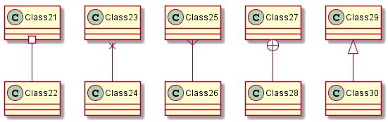 


### 关系上的标识符

#### 1、 在关系之间使用标签来说明时, 使用 `:`后接 标签文字。 

 对两边元素的说明，你可以在每一边使用 `""` 来说明. 

```
@startuml

Class01 "1" *-- "many" Class02 : contains

Class03 o-- Class04 : aggregation

Class05 --> "1" Class06

@enduml
```

 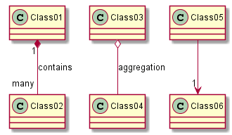 


#### 2、 在标签的开始或结束位置添加`<` 或 `>`以表明是哪个对象作用到哪个对象上。 

```
@startuml
class Car

Driver - Car : drives >
Car *- Wheel : have 4 >
Car -- Person : < owns

@enduml
```

 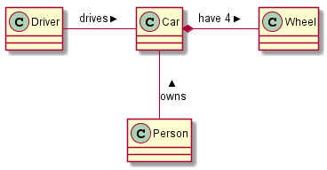 


### 添加方法

 1、为了声明字段(对象属性）或者方法，你可以使用类后接字段名或方法名 

 **系统检查是否有括号来判断是方法还是字段。** 

```
@startuml
Object <|-- ArrayList

Object : equals()
ArrayList : Object[] elementData
ArrayList : size()

@enduml
```

 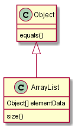 


 2、也可以使用`{}` 把字段或者方法括起来 

**注意，这种语法对于类型/名字的顺序是非常灵活的，**

```
@startuml
class Dummy {
  String data
  void methods()
}

class Flight {
   flightNumber : Integer
   departureTime : Date
}
@enduml
```

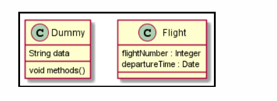


3、 可以（显式地）使用 `{field}` 和 `{method}` 修饰符来覆盖解析器的对于字段和方法的默认行为 

```
@startuml
class Dummy {
  {field} A field (despite parentheses)（表示当前是字段）
  {method} Some method（表示当前是方法，并没有加括号）
}

@enduml
```

 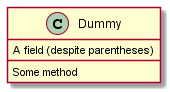 


### 可访问性

用来定义类和字段的可访问性

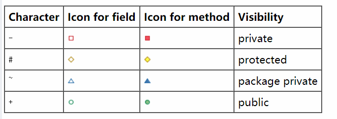


1、普通用法：

```
@startuml

class Dummy {
 -field1
 #field2
 ~method1()
 +method2()
}

@enduml
```

 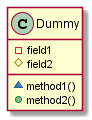 


 可以采用以下命令停用这些特性 `skinparam classAttributeIconSize 0` ： 

```
@startuml
skinparam classAttributeIconSize 0
class Dummy {
 -field1
 #field2
 ~method1()
 +method2()
}

@enduml
```

 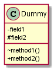 


### 抽象与静态

 通过修饰符`{static}`或者`{abstract}`，可以定义静态或者抽象的方法或者属性。 

 这些修饰符可以写在行的开始或者结束。也可以使用`{classifier}`这个修饰符来代替`{static}`. 

```
@startuml
class Dummy {
  {static} String id
  {abstract} void methods()
}
@enduml
```

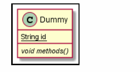


### 高级类体（分隔符）

 PlantUML默认自动将方法和属性重新分组，你可以自己定义分隔符来重排方法和属性，下面的分隔符都是可用的：`--``..``==``__`. 

- `--`表示增加一行虚线
- `..` 表示增加一行虚线
- `==` 增加一行双横线
- `__` 增加一行单横线
- `== xxx ==` 表示在双横线中增加一些字符并剧中

```
@startuml
class Foo1 {
  You can use
  several lines
  ..
  as you want
  and group
  ==
  things together.
  __
  You can have as many groups
  as you want
  --
  End of class
}

class User {
  .. Simple Getter ..
  + getName()
  + getAddress()
  .. Some setter ..
  + setName()
  __ private data __
  int age
  -- encrypted --
  String password
}

@enduml
```

 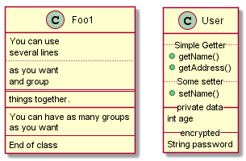 


### 备注和模板

 1、模板通过类关键字("`<<`"和"`>>`")来定义 

2、你可以使用`note left of` , `note right of` , `note top of` , `note bottom of`这些关键字来添加备注.

3、你还可以在类的声明末尾使用`note left``note right``note top``note bottom`

4、此外，单独用`note`这个关键字也是可以的，使用 `..` 符号可以作出一条连接它与其它对象的虚线。 

```
@startuml
class Object << general >>
Object <|--- ArrayList

note top of Object : In java, every class\nextends this one.

note "This is a floating note" as N1
note "This note is connected\nto several objects." as N2
Object .. N2
N2 .. ArrayList

class Foo
note left: On last defined class

@enduml
```

 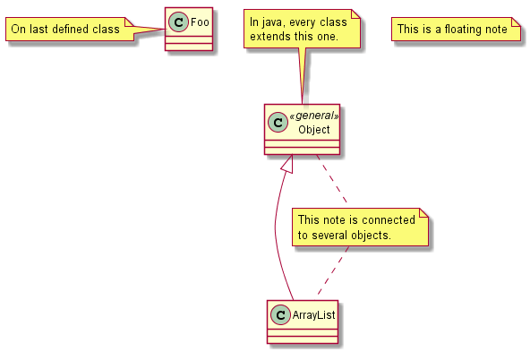 


### 链接的注释

在定义链接之后，你可以用 `note on link`

如果想要改变注释相对于标签的位置，你也可以用 `note left on link``note right on link``note bottom on link`

```
@startuml

class Dummy
Dummy --> Foo : A link
note on link #red: note that is red

Dummy --> Foo2 : Another link
note right on link #blue
this is my note on right link
and in blue
end note

@enduml
```

 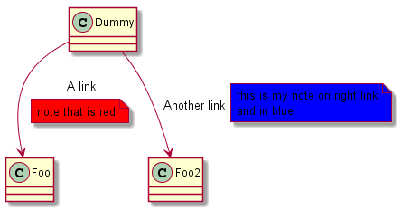 


### 抽象类与 接口、枚举、注解

 用关键字`abstract`或`abstract class`来定义抽象类。抽象类用斜体显示。 也可以使用`interface`, `annotation` 和 `enum`关键字。 

```
@startuml

abstract class AbstractList
abstract AbstractCollection
interface List
interface Collection

List <|-- AbstractList
Collection <|-- AbstractCollection

Collection <|- List
AbstractCollection <|- AbstractList
AbstractList <|-- ArrayList

class ArrayList {
  Object[] elementData
  size()
}

enum TimeUnit {
  DAYS
  HOURS
  MINUTES
}

annotation SuppressWarnings

@enduml
```

 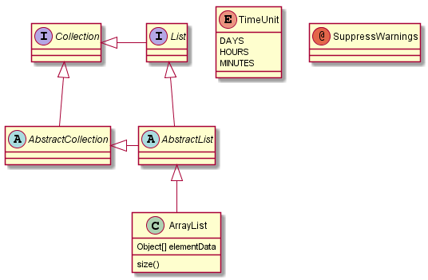 


### 使用非字母字符

如果你想在类（或者枚举）的显示中使用[非字母符号](https://plantuml.com/zh/unicode)

- 在类的定义中使用 `as` 关键字
- 在类名旁边加上 `""`

```
@startuml
class "This is my class" as class1
class class2 as "It works this way too"

class2 *-- "foo/dummy" : use
@enduml
```

 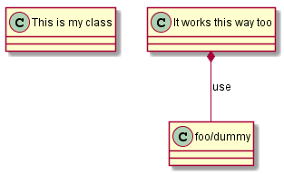 


### 隐藏属性、函数等

通过使用命令“`hide/show`

**基础命令是: `hide empty members`**

除 `empty members`

- `empty fields` 或者 `empty attributes` 空属性,
- `empty methods` 空函数，
- `fields` 或 `attributes` 隐藏字段或属性，即使是被定义了
- `methods` 隐藏方法，即使是被定义了
- `members` 隐藏字段 和 方法，即使是被定义了
- `circle` 类名前带圈的，
- `stereotype` 原型。

同样可以使用 `hide或者show`， 对以下内容进行设置： 

- `class` 所有类，
- `interface` 所有接口，
- `enum` 所有枚举，
- `<>` 实现 *foo1* 的类，
- 一个既定的类名。

 你可以使用 `show/hide` 命令来定义相关规则和例外。 

```
@startuml

class Dummy1 {
  +myMethods()
}

class Dummy2 {
  +hiddenMethod()
}

class Dummy3 <<Serializable>> {
String name
}

hide members
hide <<Serializable>> circle
show Dummy1 methods
show <<Serializable>> fields

@enduml
```

 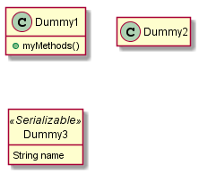 


### 泛型（generics）

 用 `<` 和 `>` 来定义类的泛型。 

```
@startuml

class Foo<? extends Element> {
  int size()
}
Foo *- Element

@enduml
```

 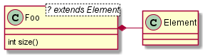 


### 指定标记（Spot）与颜色

 通常标记字符 (C, I, E or A) 用于标记 类(classes), 接口（interface）, 枚举（enum）和 抽象类（abstract classes）. 

 定义原型时，可以增加对应的单个字符及颜色，来定义自己的标记（spot），就像下面一样： 

```
@startuml

class System << (S,#FF7700) Singleton >>
class Date << (D,orchid) >>
@enduml
```

 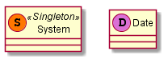 


### 包

 可以通过关键词 `package` 声明包，同时可选的来声明对应的背景色（通过使用html色彩代码或名称）。 

 **注意：包可以被定义为嵌套。 **

```
@startuml

package "Classic Collections" #DDDDDD {
  Object <|-- ArrayList
}

package net.sourceforge.plantuml {
  Object <|-- Demo1
  Demo1 *- Demo2
}

@enduml
```

 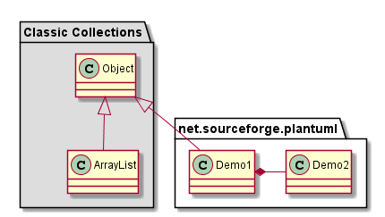 


### 棒棒糖 接口

需要定义棒棒糖样式的接口时可以遵循以下语法:

- `bar ()- foo`
- `bar ()-- foo`
- `foo -() bar`

```
@startuml
class foo
bar ()- foo
@enduml
```

 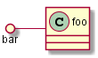 

